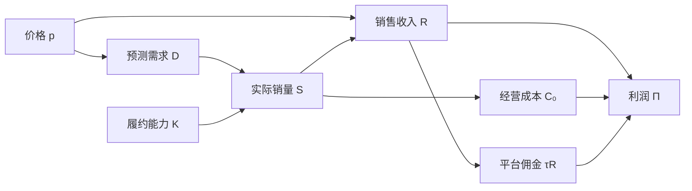

# 经济数学第二讲精修设计方案

本讲题为“函数与营销定量模型”，拟制作50页课件，分两个45分钟课时完成。以平台商家的定价与履约问题贯穿映射、函数、经济定义域、复合函数和反函数，再用同一组条件讨论利润与经营决策。课内包含五次独立作答，共20分钟，反馈与讨论另计入90分钟预算。

方案依据截至2026年10月9日的课程讨论制定，供逐页编写、数学审校、数字人讲稿制作及课堂试讲使用。它替代本讲先前的60页和135分钟设计预算。现有26页课件暂不改动；第1讲和第3讲以后的内容不在本次精修范围内。

## 一 教学定位与内容取舍

学生已有高中函数、方程、不等式和二次函数基础；反函数按新概念讲授。严谨性落实在定义、适用条件、推导依据和结论边界上。定义域主要通过经营约束建立，分式与根式求定义域只作必要的先修补充，不占课堂主线。

本讲结束时，学生应能完成六项任务：

1. 陈述映射的定义，分别解释“每一个”和“唯一”，辨析多对一与一对多。
2. 区分定义域、陪域和值域，并给每一项经济输入限制说明依据。
3. 根据履约要求建立可行价格集合，解释可行集为空的含义。
4. 写出复合函数及其定义域，区分需求量与实际履约量在成本计算中的作用。
5. 在单射条件下建立到原函数值域的反函数，验证互逆关系，解释不可逆时损失了什么信息。
6. 通过分段、配方和可行范围比较定价方案，说明固定成本、平台抽成和停业条件如何影响结论。

课内不使用导数求最值，不系统展开满射、双射、随机需求估计、多元函数、弹性或平台竞争。可以在教师备课中解释“映射到指定陪域的双侧逆需要双射”，学生主线采用“单射到其值域可逆”的表述。

重要问题至少包含一次依据说明、一次条件变化或一次反例判断。观察曲线的涨跌用于提出猜测，后续需要计算或论证。页面标题直接使用数学概念或具体问题，例如“反函数存在的条件”“履约上限是否限制价格”“固定成本提高会改变最优价格吗”。

## 二 贯穿案例及其边界

### 主案例 平台商家的定价与履约

经营对象为同一种标准化商品。所有数值均为自拟教学参数，不标为真实企业资料。模型描述一日内、其他经营条件固定时的连续数量近似。

| 符号 | 含义与单位 | 基准设定 |
| --- | --- | --- |
| p | 报价，元每件 | 连续分析区间 P＝[30,100] |
| G | 实际允许的报价集合 | {30＋0.5k：k＝0,1,…,140} |
| D(p) | 给定价格下的预测日需求，件每日 | 1200−10p |
| K | 每日最大履约量，件每日 | 400 |
| S(p) | 实际日销量，件每日 | min{D(p),K} |
| τ | 平台按实际销售额收取的佣金比例 | 0.10 |
| c | 每件已履约商品发生的变动成本，元每件 | 20 |
| F | 日固定经营成本，元每日 | 2000 |
| R(p) | 日销售收入，元每日 | pS(p) |
| C₀(s) | 不含平台佣金的日经营成本，元每日 | F＋cs |
| Π(p) | 日经营利润，元每日 | (1−τ)pS(p)−C₀(S(p)) |

参数10的含义为：价格每提高1元每件，模型需求量减少10件每日。参数1200的单位为件每日。P用于连续函数分析；G用于实际报价核验。连续模型的值域与格点模型的值域不得混写。

图中箭头表示本模型的计算依赖。价格与销量共同确定收入；仅由需求经过成本一路相连，不能完整表示利润计算。

基准模型还约定：商品按已履约数量发生变动成本；不预先采购并报废大量库存；没有退货、跨日库存、广告变化或竞争者反应；需求超过能力时允许未满足部分需求；销售额按同一标价结算。若改成预购库存、退货补贴或无法拒单业务，必须改写成本或可行集。

### 观察范围与教学假设分开处理

第12页暂给“只在40至60元间观察过需求”的资料，用于说明：非负性、已有资料覆盖范围和允许决策集合的作用不同。该资料不能自行证明模型在30至100元内仍然成立。

第18页开始明确增加教学假设：“以下练习约定，在P＝[30,100]内采用给定需求关系。”随后80元最优等结论均以该假设成立为前提。不能把40至60元的观察直接包装成80元定价建议的经验依据。

### 已核验的主案例结果

- D在P上的值域为[200,900]。
- S(p)＝400，当30≤p≤80；S(p)＝1200−10p，当80＜p≤100。
- S在P上的值域为[200,400]；实际采用G时，需求及销量取相应离散值。
- 若必须满足全部预测需求，则要求D(p)≤400，可行连续价格为[80,100]，实际报价为G∩[80,100]。
- D⁻¹(q)＝120−q/10，定义域[200,900]，值域[30,100]。
- S在P上没有反函数；限制到[80,100]后有反函数，定义域[200,400]，表达式同为120−s/10。
- Π(p)＝360p−10000，当30≤p≤80；Π(p)＝−9p²＋1280p−26000，当80＜p≤100。两段在80元处的值均为18800元每日。
- 右段二次表达式可配方为175600/9−9(p−640/9)²。其延伸顶点价格640/9约为71.11元，不属于右段适用范围。
- 连续区间和报价集合G上的最优价格均为80元，最大日利润18800元。

| p | D(p) | S(p) | 销售收入 | 经营成本不含佣金 | 利润 |
| --- | --- | --- | --- | --- | --- |
| 50 | 700 | 400 | 20000 | 10000 | 8000 |
| 80 | 400 | 400 | 32000 | 10000 | 18800 |
| 90 | 300 | 300 | 27000 | 8000 | 16300 |

各金额均为元每日。佣金已经在利润中扣除，不能把表中的“不含佣金成本”误称为全部支出。

## 三 两个课时的组织

| 课时 | 页码 | 主要内容 | 独立作答 | 合计 |
| --- | --- | --- | --- | --- |
| 第一课时 | 01至25 | 映射与函数，经济定义域，需求与销量，复合函数 | 第15页4分钟，第23页5分钟 | 45分钟 |
| 第二课时 | 26至50 | 反函数，利润函数，受约束的最值，条件变化，综合练习 | 第32页3分钟，第39页4分钟，第47页4分钟 | 45分钟 |

两课时之间的课间休息不计入90分钟。50页均进入主线；课后拓展写入练习单和教师讲稿，不额外加入主线页数。分步揭示是当前页的状态，不另计页面。

下列逐页时间包括讲解、短问答和切换。独立作答时间单列在相应页面；教师不能把它再次用于持续讲述。首轮试讲若超时，先压缩教师重复解释与拓展追问，保留独立作答和反馈。

## 四 第一课时逐页设计

### 第01页 函数与营销定量模型

0.5分钟。投影：标题与一张平台订单和履约场景图，副题“价格怎样经过需求和履约转化为利润”。教师简述本讲要完成一次有条件、有推导的定价判断。封面不堆学习目标，不提前展示最优价格。

### 第02页 两个价格都卖出400件该选哪一个

1分钟。投影：售价50元和80元，两者实际销量均为400件。问“这两组记录足以确定哪个方案利润更高吗”。预期：必须知道成本、佣金以及经营条件是否相同。暂不公布完整答案，保留此题供第38页回访。版式为两列数据，不画暗示结论的装饰箭头。

### 第03页 把经营条件写成数量关系

1.5分钟。投影：p、D、S、K四个量与单位，给出D(p)＝1200−10p及K＝400。问“预测需求700件与实际销量400件能否同时成立”。反馈：能，允许部分需求未被满足。暂不展示利润公式，避免一次引入全部符号。逐项揭示定义与单位。

### 第04页 映射的定义

2分钟。投影严格定义：设A、B为非空集合，若对应规则f使A中的每个元素x，在B中都有唯一确定的元素y与之对应，则称f为从A到B的映射，记作f：A→B，x↦f(x)。问“定义分别对输入是否有对应和对应是否唯一作了什么要求”。保留完整定义，仅高亮关键词，不把定义拆成无法同时阅读的碎片。

### 第05页 每一个与唯一各自排除了什么

1.5分钟。两幅原生集合箭头图：一幅存在没有箭头的输入；一幅有一个输入连接两个输出。先判断，后指出分别违反存在性与唯一性。第三幅让学生判断目标集合中有未被指向元素是否允许。反馈：允许；定义没有要求每个目标元素都被取到。

### 第06页 多个输入能否得到同一个输出

1分钟。用p＝50、60、70均可能售出400件的对应图辨析多对一。答案：可以成为函数；唯一性约束每一个输入的输出，不要求不同输入得到不同输出。本页给后面的不可逆埋下问题，暂不引入全部单射术语。

### 第07页 本课研究的一元实函数

1.5分钟。定义：给定非空实数集A，映射f：A→R称为定义在A上的一元实函数。说明自变量、函数值和对应法则。以D(p)为例，问“p、D(p)和1200分别扮演什么角色”。反馈区分输入、输出与给定参数。陪域可按具体问题指定为实数的子集。

### 第08页 定义域陪域和值域

2分钟。暂设D：[30,100]→R。求值域[200,900]，在区间图上同时显示输入范围、指定目标集合和实际取值范围。问“把陪域写为R是否意味着需求会取到负数”。答案：否，实际输出由定义域和对应法则共同决定。严格保留D(P)⊆R的包含关系。

### 第09页 公式相同是否就是同一个函数

1.5分钟。比较定义在[40,60]与定义在[30,100]上的两个需求函数，二者使用同一表达式。问“它们在50元处相等，是否意味着两个函数相同”。反馈：定义域不同，因此不是同一个函数；前者是后者在较小区间上的限制。本页不转入根式和分式训练。

### 第10页 价格的允许范围由谁决定

1分钟。投影问题“允许把哪些数作为p代入这个经济函数”。暂列可核对的条件：数学运算、经济含义、经营规则、模型假设。要求每个条件必须给出具体依据。本页只是承接，结论由后续经营条件逐项建立。

### 第11页 非负条件能确定多大范围

1.5分钟。先指出一次表达式代数上可对任意实数计算。再按此商品的教学设定提出p≥0与D(p)≥0，推出[0,120]。问“这是否已经证明整个区间都是可靠的预测范围”。答案：没有；它只满足当前非负条件。负价格在其他经济制度中的可能性不在本题假设内，不能把本题约定说成普遍定律。

### 第12页 只观察过40至60元能推出什么

2分钟。给出资料覆盖区间[40,60]，要求判断“是否已证明80元处的需求”。反馈：已有观察不自动验证区间之外的函数关系；区间内有记录也不等于所有点均已证实。图中观察区间用实线标识，外推部分用虚线并标注假设，不把外推画成已观测事实。

### 第13页 实际报价为什么可能是离散集合

1.5分钟。商家允许售价30至100元，每次按0.5元调整。写出G＝{30＋0.5k：k＝0,1,…,140}。追问30.25元能否报价、[30,100]是否完整表达该规则。答案：不能，仅写连续区间遗漏了价格步长。明确后续先在连续区间P分析，最终回到G检查。

### 第14页 单位成本能否直接规定最低售价

1.5分钟。给出“单位成本20元，所以函数定义域必有p≥20”的判断。答案：仅凭成本不能推出该约束；需要额外的售价政策或经营目标。促销、清理库存等情境提示不同目标，但不在本页建立新模型。区分可计算的方案、可行方案和较优方案。

### 第15页 课堂练习一根据经营承诺确定可行集

4分钟独立作答。题设在本页完整保留：G、D(p)、K＝400，并暂以需求关系适用于整个报价集合为条件假设。问题A：允许拒绝超出能力的订单，是否需要加入D(p)≤400。问题B：承诺满足全部预测需求时，如何写可行价格集合。问题C：若还要求p≤70，问题B是否有可行方案。投影只显示题目与作答要求，不显示答案。可给提示“分别写出每项承诺对应的不等式”。

### 第16页 允许缺货与必须履约是两种条件

2分钟反馈。A保留G，销量需截断；B为G∩[80,100]；C为空集。每一步先说明条件，再解不等式，最后取交集。追问“为什么同一个能力上限在两种经营承诺下产生不同处理”。答案：约束对象与允许行为不同。本页保留练习一题设摘要。

### 第17页 可行集为空意味着什么

1.5分钟。回到“承诺全部履约且价格至多70元”的条件，要求指出需要放松哪项条件或改变哪项资源。反馈：可提高履约能力、放宽价格上限或改变履约承诺，不能仅靠代数变形消除冲突。补问“若只信任40至60元的需求资料，能否直接把80元当作现实建议”。答案：还需要验证模型适用性。

### 第18页 需求量与实际销量

2分钟。明确从本页起的教学假设：D在P内有效，且允许部分需求无法履约。建立S(p)＝min{D(p),400}。显示两个阶段：先有需求，再经过履约限制得到销量。问“为什么不能把实际销量始终写成1200−10p”。这一步改变的是经济关系，不是为增加难度而随意分段。

### 第19页 从履约条件推出分段函数

2分钟。累积揭示D(p)≥400等价于p≤80，随后写出两段S。追问“80元应归在哪一段”“交界处两条表达式是否一致”。允许任何不重不漏且端点定义一致的正确写法。原生图先画需求线，再显示销量平台，公式与坐标使用同一计算模型。

### 第20页 销量函数的值域

1.5分钟。在P上求S(P)＝[200,400]。追问“值域下界为什么不是0”“p≤80的平台段有没有破坏函数的唯一性”。答案：给定价格区间的最低需求仍为200；多对一仍是函数。提醒实际报价为G时所得值域是离散集合，此图是连续分析图。

### 第21页 成本应由哪个数量决定

1.5分钟。定义C₀：[0,400]→[2000,10000]，C₀(s)＝2000＋20s。比较“把预测需求送入成本函数”与“把实际履约量送入成本函数”两条箭头链。说明成本按已履约数量发生，因此本模型应使用C₀(S(p))。这不是所有库存制度通用的成本写法。

### 第22页 复合函数及其定义域

2分钟。定义复合关系(g∘f)(x)＝g(f(x))。严格给出可定义输入集合{x∈Dom f：f(x)∈Dom g}；若要在f的整个定义域上复合，需要f的值域包含在g的定义域内。用集合包含与箭头连接表示，强调“把表达式代进去”之外还需检查中间输出是否允许。

### 第23页 课堂练习二检查复合是否有意义

5分钟独立作答。沿用P、D、S和C₀的指定定义域。求C₀∘S与C₀∘D各自可定义的价格范围，并判断C₀(D(50))在本题中是否有定义。再计算50元时实际不含佣金的经营成本。要求分别写数学依据和经营解释；提示仅提醒检查中间输出，不给出80元边界。

### 第24页 能代入表达式不等于已定义复合函数

2.5分钟反馈。C₀∘S在P上均有定义；C₀∘D仅在[80,100]可定义。D(50)＝700超出C₀的给定定义域，所以C₀(D(50))无定义。若未经说明扩展成本公式，会算出16000，但这既扩展了函数，也把未履约需求当作已发生成本。实际经营成本C₀(S(50))＝10000元。保留题设与完整推导。

### 第25页 第一课时检验

1分钟。快速判断三句：多对一不属于函数；成本为20元自动要求售价至少20元；复合函数只需做代数代换。三句均不成立，要求各指出一个关键依据。反馈只揭示对应关键词“唯一性针对单个输入”“约束需要依据”“检查中间输出范围”。作为下一课时调整讲解速度的依据。

## 五 第二课时逐页设计

### 第26页 已知结果能否确定输入

0.5分钟。并列提出“已知预测需求400件”和“已知实际售出400件”。问两者能否唯一反推价格。暂收集判断，不给一般定义；这是反函数的新概念入口。

### 第27页 反函数存在的条件

2.5分钟。说明单射：不同输入对应不同输出；等价地f(x₁)＝f(x₂)能推出x₁＝x₂。若f：A→B是单射，则可定义f⁻¹：f(A)→A，令每个函数值返回唯一的原输入。强调反函数的定义域是原函数的值域。箭头翻转前后并排显示，不能简单宣称任何映射均可反转。

### 第28页 反函数与倒数

1分钟。比较D⁻¹(400)＝80与1/D(80)＝1/400。前者输入需求量，输出价格；后者输入价格，输出需求量的倒数。指数负一在这两种写法中的含义不同。通过输入输出单位检查，避免只靠记忆符号区分。

### 第29页 求需求函数的反函数

2分钟。从q＝1200−10p解得p＝120−q/10。完整写出D⁻¹的定义域[200,900]和值域[30,100]。问“只写出交换字母后的公式，是否已经完整求得反函数”。反馈：还必须说明原函数可逆，并给反函数的范围。讲解不预设高中已学过反函数。

### 第30页 怎样验证互为反函数

1.5分钟。分别验证D⁻¹(D(p))＝p与D(D⁻¹(q))＝q，标清p∈P和q∈[200,900]。只揭示两次短代入，要求说明每一步的输入均在允许范围内。图像可给关于y＝x对称的辅助示意，但不以交换坐标轴替代代数验证。

### 第31页 销量函数为什么不可逆

2分钟。找出S(50)＝S(80)＝400，用一个反例否定单射。反向箭头从400指向多个价格。问“原函数仍然存在，为什么反函数不存在”。反馈：正向输出唯一与反向输入唯一是两个条件。图形只辅助说明，结论必须回到定义。

### 第32页 课堂练习三限制定义域后求反函数

3分钟独立作答。给出S的分段式，要求选取一个有正长度的价格区间，使限制后的函数可逆；写出反函数及其定义域，并说明是否保留销量400这一结果。提示可观察哪一段的不同价格对应不同销量。允许多种正确限制，不能只把标准答案当作唯一正确方案。

### 第33页 反函数取决于如何限制原函数

2分钟反馈。标准选择[80,100]，反函数120−s/10，定义域[200,400]。选择[85,100]也正确，但反函数定义域为[200,350]，不再保留400。问“表达式相同，两个反函数是否相同”。答案：定义域不同，函数不同。保留学生方案并比较其保留与丢失的经济结果。

### 第34页 售出400件到底说明什么

1分钟。在本模型和准确销量记录条件下，由S(p)＝400可推出D(p)≥400、p∈[30,80]；不能确定唯一价格，也不能断定D＝400。若商家知道当天价格，还可按模型计算预测需求，但这来自额外信息。以等式、集合和文字解释三个层次呈现。

### 第35页 销量相同是否意味着需求相同

0.5分钟。用50元与80元同售400件作反例：模型需求分别为700和400。指出记录未满足订单、候补或缺货情况有助于理解被履约上限遮蔽的需求；这些记录仍需核验。此页只完成一个短判断，不展开需求估计方法。

### 第36页 收入成本与利润的关系

1.5分钟。补齐τ＝10%、c＝20、F＝2000。写R(p)＝pS(p)，平台佣金τR(p)，经营成本C₀(S(p))，利润Π(p)＝(1−τ)pS(p)−C₀(S(p))。追问“同为400件，收入为什么还可能不同”。反馈：实际销量不能在整个P上唯一确定价格，因而也不能仅由s唯一确定本模型收入。

### 第37页 利润函数为什么也要分段

2分钟。将S的两段代入，得到360p−10000与−9p²＋1280p−26000，并始终标注各自适用价格范围。问“二次表达式能否用于50元的利润”。答案：不能直接用于该分支以外；50元实际销量受到能力约束。各项金额使用元每日，平台佣金单列后再合并。

### 第38页 回答开场的定价问题

2分钟。逐步计算50、80、90元时的销量、收入与利润，结果分别为8000、18800、16300元每日。回访第02页：现在可以比较，因为已补齐成本与佣金条件。追问“三个价格中80元最好，是否已经证明整个价格范围上最优”。答案：还没有，需要处理全部允许价格。

### 第39页 课堂练习四证明最优价格

4分钟独立作答。题面保留两段利润式及其范围。要求分别确定两段的最大值或上界，最后比较，且不得使用导数。给两级可选提示：线性段看系数；二次表达式可配方。进阶要求解释二次式顶点能否成为该段候选。答案由教师点击后在下一页公开。

### 第40页 顶点必须落在适用范围内

2.5分钟反馈。左段随p增加，在80元处取18800。右段二次表达式顶点为640/9，但不在(80,100]；在该区间内，离顶点越远平方项越大，因此利润严格低于80元处的边界值。合并两段得全局最优p＝80。禁止只报告顶点71.11元。图上实线只绘制各自有效区间，外延顶点若展示必须标作表达式延伸。

### 第41页 最优价格是否可以实际报价

1分钟。检查80∈G，因此连续最优也为实际报价最优。问“若算出的连续最优价格不在G中，是否能原样报价”。答案：不能，在当前分段模型中要结合各段变化规律，比较候选附近的可行报价及相关边界；不能把未经比较的舍入结果称为已证明最优。本题不另外展开新参数计算。

### 第42页 固定成本提高会改变最优价格吗

1.5分钟。将F从2000改为6000，其他条件不变且限定继续营业。全部价格下利润统一减少4000，最优价格仍为80，最大利润变为14800。要求给出理由“任何两种价格之间的利润差不变”。不把这一结论延伸到固定成本随价格或规模变化的情况。

### 第43页 亏损时是否应该立即停业

2分钟。给出F＝22000，继续营业的最高日利润为−1200。若停业能避免全部F，则停业收益0，高于继续营业；若当天F已不可避免，且停业没有其他支出，则停业收益−22000，继续营业更好。投影清楚列出两个情境的停业收益。此题训练比较可选方案，避免把会计亏损直接当作停业结论。

### 第44页 抽成提高是否一定提高最优售价

1.5分钟。比较τ＝10%与20%，其余条件相同。给出两组经计算核验的最优价格都为80元，最大利润分别为18800与15600。要求用反例否定“抽成一提高，最优售价就一定提高”。解释履约边界仍起作用。答案先隐藏，保留短暂预测时间。

### 第45页 条件继续变化时结论会不会改变

1.5分钟。将τ＝60%作为纯教学敏感性情境，明确不是实际平台费率。此时右段二次式为−4p²＋680p−26000，顶点85元位于适用范围内，最大利润2900；80元利润2800。结论：前一页否定“必然提高”，并没有证明“永不改变”。50%阈值的代数推导放到课后拓展。

### 第46页 模型最优与经营建议的距离

0.5分钟。问“真正采用80元售价之前，最需要核实哪项条件”。接受需求关系适用范围、实际履约能力、抽成口径、成本发生方式等有针对性的回答。要求选择一项并说明它会改变哪一个函数或约束。避免泛泛罗列“模型有局限”。

### 第47页 综合练习新的经营条件

4分钟独立作答。另给预订制商品：D₂(p)＝1000−8p，p∈[40,100]，每次调价0.5元，K＝320，τ＝15%，每件已履约成本30元，固定成本1500元每日，允许部分需求不能履约。问题：写实际报价集合与销量函数；判断满额售出320件能否唯一确定价格；比较75、85、95元三个价格的利润。要求至少写一条结论成立的条件。这里仅比较三个方案，不要求在4分钟内证明全局最优。

### 第48页 综合练习的可行集与逆向判断

2分钟反馈。G₂＝{40＋0.5k：k＝0,…,120}；S₂在[40,85]为320，在(85,100]为1000−8p。满额销量只能给出p∈G₂∩[40,85]，不能唯一反推价格。若业务改为必须满足全部需求，可行报价改为G₂∩[85,100]。保留原题设，逐项对应条件。

### 第49页 综合练习的利润与结论

2分钟反馈。利润为(0.85p−30)S₂(p)−1500。75、85、95元的日利润分别为9300、12020、10680；因此给定三种方案中85元最好。不能仅凭这三次计算宣称所有允许价格中85元全局最优。全局证明作为课后题，并允许参考第39至40页的方法。

### 第50页 本讲结论与课后任务

1分钟。用四个数学结论收束：函数要求逐一存在且输出唯一；经济定义域需要条件依据；复合检查中间范围、反函数检查单射；决策比较必须在共同条件与可行范围内进行。布置必做题“完成综合案例全局最优证明”，选做题“抽成阈值与扩容成本”。本页不新增模型或术语。

## 六 课堂练习单与反馈标准

学生版练习单安排五个作答区，分别对应第15、23、32、39、47页。每区重复必要条件，留出集合表达、计算和一句话解释的位置。教师版另含答案、部分得分标准和典型错因。课内不要求登录、提交平台作业或等待数字评分；纸笔即可完成。

| 练习 | 作答时间 | 必须出现的证据 | 典型错因 |
| --- | --- | --- | --- |
| 一 | 4分钟 | 区分是否允许拒单；写出集合交集；识别空集 | 把履约能力直接当作价格限制，遗漏经营承诺 |
| 二 | 5分钟 | 写复合定义域；检查700不在C₀定义域；实际成本10000 | 仅作代换，把未履约需求计入成本 |
| 三 | 3分钟 | 可逆区间、反函数表达式、反函数定义域 | 把平台段也纳入，或把原定义域照抄为反函数定义域 |
| 四 | 4分钟 | 两段范围、各自候选或上界、全局比较 | 把不在分支范围内的顶点71.11当作最优 |
| 五 | 4分钟 | 报价格点、分段销量、三种利润、结论范围 | 将三点比较夸大为全局最优证明 |

练习评价以依据完整为先：正确表达但算术小错，可以保留方法得分；只写最终数值而没有范围或条件，不视为完全掌握。每次反馈至少针对一个常见错误解释“为什么错”，随后用一个短变式确认学生是否修正。

若学生先修差异明显，提示分为两级，均由教师决定是否公开。第一级指出应检查的对象，第二级给出部分关系。直接答案保持独立的最后揭示。较快学生在同页完成附加证明，不另开一条课件主线。

## 七 数学口径与教师拓展答案

### 定义应保持一致

函数相等的课内辨析在共同实数背景下比较定义域和逐点对应法则。涉及不同指定陪域的映射时，教师应明确所用映射约定，避免把陪域与值域混用。

反函数存在不能只说“交换x与y”。若要构造f⁻¹：B→A并在两边均为恒等，需要f对指定B既单射又满射。本讲将逆函数定义域取为f(A)，因此主要检查单射；教师不能把“单射即可”脱离“到其值域”这一限定。

需求量采用连续近似。真实订单数量具有整数性；本题0.5元报价格点使主案例需求量按5件变化，数值练习无须另外取整。若后续更换参数，必须重新核验整数性和取整方式，不能悄悄改变需求规则。

### 课后必做题

综合案例中，S₂的分界点为85元。利润在[40,85]为272p−11100，在(85,100]为−6.8p²＋1090p−31500。右段延伸顶点1090/13.6约为80.147元，低于85，因此两段合并后的全局最优为85元，利润12020元每日；85也是G₂中的可行价格。

评分建议共10分：可行价格集合2分，销量分段与边界2分，利润分段2分，分段最值及全局比较3分，单位与模型条件1分。

### 课后选做题一 抽成阈值

在主案例中保留K＝400、c＝20、连续价格P，并限定继续营业。令a＝1−τ且0≤τ＜1。右段利润为−10ap²＋(1200a＋200)p−26000，延伸顶点为60＋10/a。

连续价格最优在0≤τ≤0.5时为80；在0.5＜τ＜0.75时为60＋10/(1−τ)；在0.75≤τ＜1时为100。实际报价G上需比较候选附近的格点及边界，不能直接套连续结论。若允许退出经营，还要加入停业方案。

此推导解释第44与45页的差异。课内只展示两个反例和结论边界，不要求全班在短时间内完成参数分段。

### 课后选做题二 扩容是否值得

若K由400增加至500且其他条件不变，在基准价格区间内单位贡献0.9p−20非负，故每一固定价格下的利润不会因免费扩容而降低。然而，利润是否严格提高、提高多少，以及新增能力是否收费，仍须计算。

K＝500时连续最优价格为640/9，最大利润175600/9，约19511.11元每日。按G报价时最优为71元，利润19511元，每日增益711元。若扩容新增固定成本为1000元每日，则扩容后最大利润18511元，低于不扩容时的18800元。不能将“免费扩容不会降低最优利润”偷换为“付费扩容一定值得”。

### 课后选做题三 相同记录能否确定同一个函数

另设不受履约上限截断的函数识别练习，给两组自拟需求资料：(40,800)与(60,600)。在[40,60]上，D₁(p)＝1200−10p和D₂(p)＝1200−10p＋0.4(p−40)(p−60)都经过这两个点，但50元处分别为700和660。两者在该区间均严格递减。

不使用导数的单调性证明：对40≤x＜y≤60，D₂(y)−D₂(x)＝(y−x)[−10＋0.4(x＋y−100)]＜0。由此可见，“符合两个点且方向合理”仍不足以唯一确定需求函数。此题不是主案例中截断销量记录的直接估计，更不能凭观察吻合直接作因果结论。

## 八 版式与分步揭示

画布保持1600×1000。沿用暖白纸色、深墨正文、青灰图形和赭红强调。标题使用宋体，正文使用黑体；标题64至80px，正文30至36px，主要公式36至48px，图形标注至少24px。具体字号须在最长公式和窄屏预览中复核。

封面与情境页使用已有编辑拼贴素材。集合箭头、区间、格点、分段图像与利润曲线均使用原生可编辑图形，不让生成图片承载公式、坐标或数据。真实感来自订单、履约、佣金等条件，而不是在每页叠加商业照片。

建议构成主义用于第05、14、17、31、40、43页中的错误冲突或条件冲突，共6页，占12%。教师反馈文字仍保持正常阅读方向，不使用倾斜公式和旋转坐标轴。

主要版式采用：定义与集合图左右对照；题设固定在上方的连续推导；经营条件与可行集对应表；同坐标需求线和销量线；题目和反馈前后配对。避免每页重复三个圆角卡片。

揭示规则：

- 严格定义完整保留，只逐项强调，不逐字打散。
- 题设和已完成步骤持续可见；新页仅用于新的判断、表示或任务阶段。
- 图像先显示坐标、范围和输入关系，再显示截断销量，最后显示当前公开的候选点；禁止提前显示最优标记。
- 学生独立作答页不自动播放答案；反馈页也从题设开始，答案由教师控制。
- 范围图明确区分连续区间与离散格点，端点实心、空心与公式不等号一致。
- 经济条件变化页保留基准条件，只突出本次变化项，避免学生把多个版本的参数混用。

## 九 数字人讲解设计

为50页逐页编写讲稿，每页包含起始讲解和与公开步骤一一对应的补充段落。已有讲稿只作为素材，不能靠替换页号复用旧解释。讲稿用自然中文准确读出映射、定义域、逆函数、区间和单位。

“数字人讲解本页”只介绍已经公开的材料；“公开下一步并讲解”先公开对应内容再播放其讲稿。定义页应逐句解释量词；推导页应说清使用条件；练习页只读题、说明作答要求，随后停下。默认不自动翻页、不自动进入答案，不用大模型临场补全隐藏推导。

第15、23、32、39、47页可配置教师侧计时提示，分别为4、5、3、4、4分钟。计时结束只提醒，不公开答案。教师可暂停或延长。数字人控制区位于投影画布之外，语速和停止操作沿用现有界面。

所有实验数值旁白从当前模型计算读取。改变价格、抽成、能力或页码时，中断旧音频；学生看到的步骤、字幕与当前公开内容保持一致。完整教师PDF可显示全部答案，学生端与助教上下文只包含已公开材料。

## 十 制作接入与验收

### 交付内容

实施阶段交付50页交互课件、两份45分钟逐页讲稿、五题学生练习单及教师答案、含完整推导的备课PDF、逐页数字人讲稿，以及模型核验记录。主案例实验至少展示价格、需求、销量、收入、佣金、经营成本和利润，保持教师操作、学生只读。

### 接入范围

新第2讲应成为独立编写的内容模块，不再直接串接两个旧讲次数组。保留原26页版本及其讲稿对应，使用独立页面键和新发布版本；历史课堂按原版本识别，不用新第2讲页码自动覆盖旧页码。

当前全课程388页，若其余页面保持不变，新第2讲50页替换原26页后预计为412页。注册、导航、导出和课堂分发都从内容清单取得数量，不手填固定总数。第1讲仍为40页，第3讲起编号不变。

本讲按最新要求改为2学时。先前讲次调整中，第1讲为1学时、第2讲为3学时；此次减少的1学时应在全课程排课时统筹，例如另安排第一单元习题课。本方案不把该45分钟塞回本讲，也不自行修改其他讲次或课程总学时登记。

### 制作顺序

1. 先固定本方案的术语、参数、50页页序及练习答案。
2. 制作第04、15至16、23至24、27、39至40、43至45页的代表页面，核对定义、题设保留、错误反馈和经济追问。
3. 完成全部50页，逐页人工审阅学生投影文案及数字人讲稿。
4. 接入现有教师控制、学生同步和助教公开上下文，生成备课文件。
5. 完成本地验收后再试讲，依据真实作答时间调整时长和提示，不用加速旁白挤出练习时间。

### 必须通过的检查

- 数学：映射与逆函数定义、复合定义域、值域、格点、分段端点、二次式配方、分支候选点与全局比较均正确。
- 经济：需求与销量区分；佣金以实际销售额为基数；单位和时间口径一致；成本按已履约量发生；停业收益随可避免性分别计算；外推假设公开。
- 文案：逐页标题具体，学生画布中不出现“让学生”“告诉学生”等作者语言；不把一组假设下的结论写成普遍经营规律。
- 讲解：每页均有相应口播；公式不朗读成原始代码；隐藏答案不出现在起始口播、字幕或助教上下文中；返回页码恢复正确步骤。
- 交互：教师与学生同步、断线恢复、版本冲突、只读权限和停止旧音频行为通过测试。
- 视觉：遍历50页桌面与窄屏状态，检查图像、裁切、文字重叠、公式、坐标标签及完整揭示状态。
- 工程：学生文案审计、上下文测试、模型计算核验、类型检查、生产构建及git diff --check。
- 导出：教师PDF页数、阅读顺序、条件、全部答案与正文一致；学生练习单无答案泄漏。
- 教学：试讲分别记录两个45分钟预算、五题实际作答时间、反函数理解和条件解释质量。本地检查不能代替课堂效果验证。

## 十一 本轮方案核验记录

逐页预算为第一课时45分钟、第二课时45分钟；五次独立作答共20分钟。主案例分段、价格比较、抽成变式、停业比较及综合题答案已作数值核对。设计约束来自本轮课程讨论；项目接入依据现有讲次调整文档、课件定义和数字人功能。

本轮交付为设计方案，尚未制作新50页课件、练习单成品、配音或备课PDF。当前localhost课件保持原内容。
