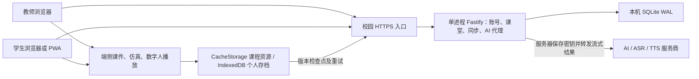
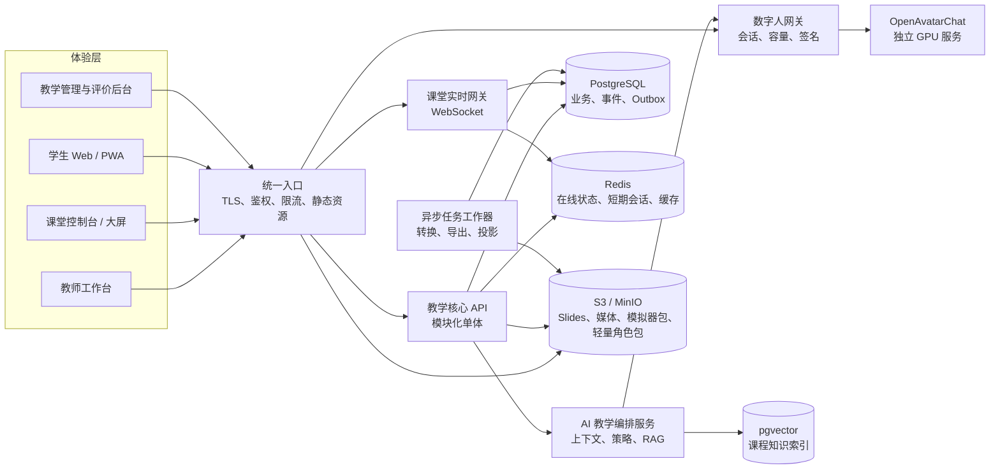
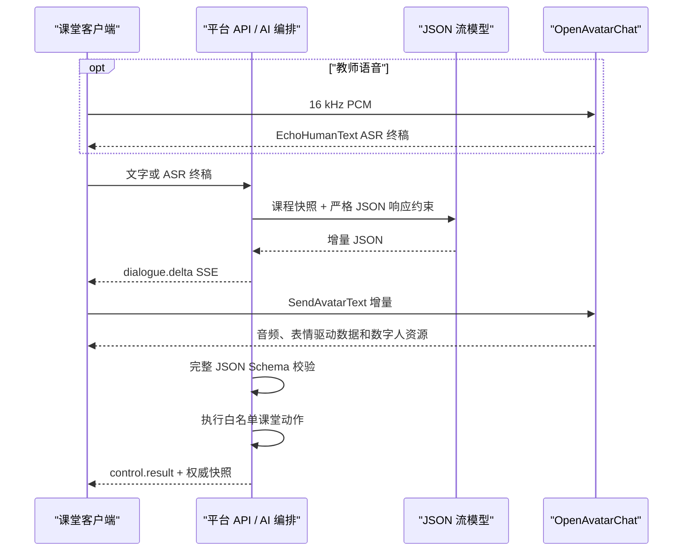
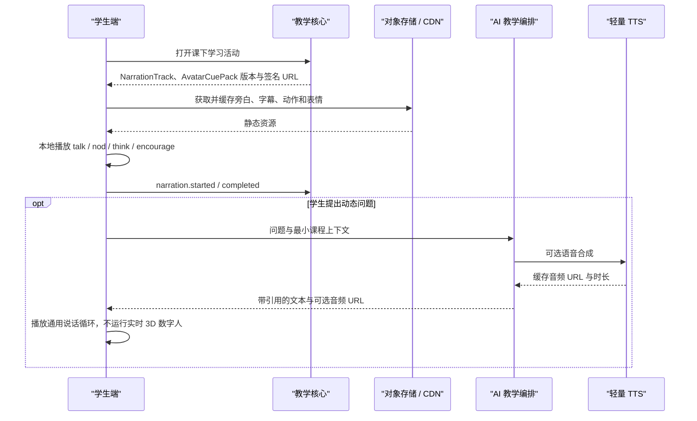
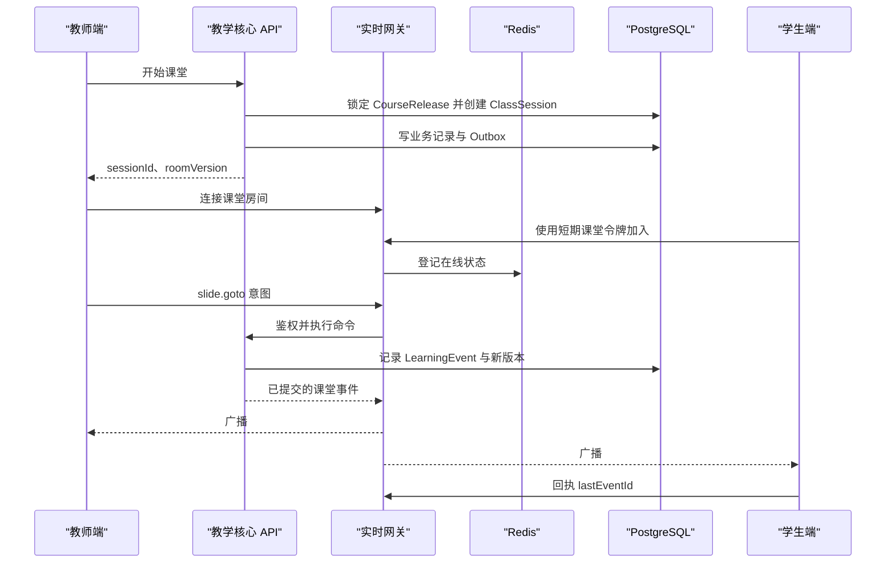
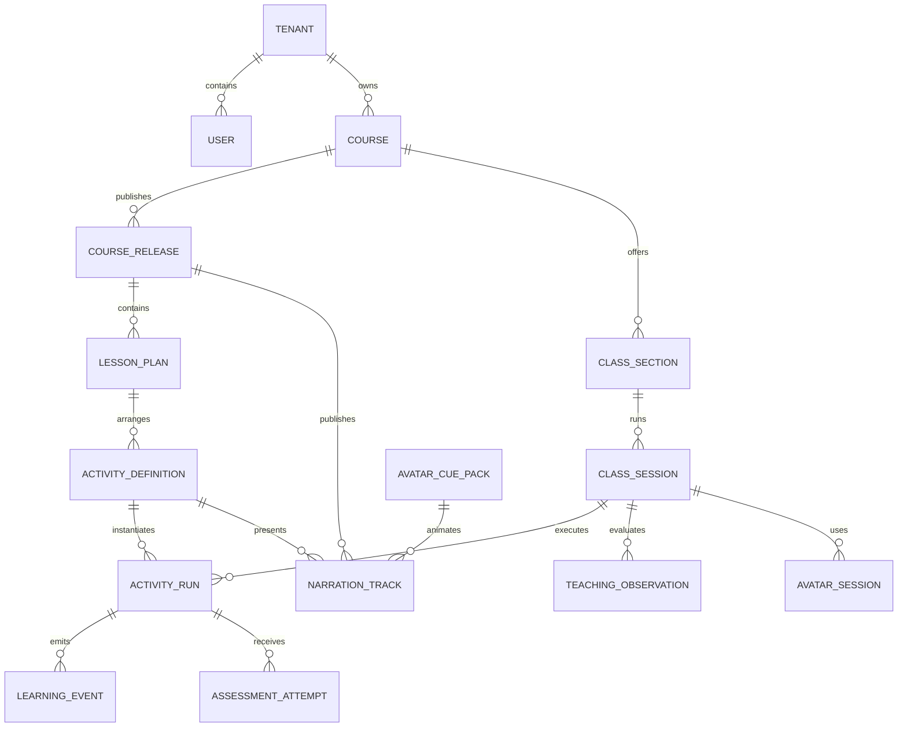

# edu-sys 总体架构

## 当前实施架构：Campus Edge v1（2026-09-08）

当前生产部署以本节和 [部署说明](campus-deployment.md) 为准。后文的 Architecture Baseline v1.1 是历史远期设计，独立网关、GPU 平面、PostgreSQL、事件重放评分等不属于本次单 PC 部署的必需组件。



| 职责 | 当前实现 | 运行位置 |
|---|---|---|
| 师生入口与权限 | 同一个静态发布包，按真实角色装载学习空间或教师工作台；API 独立校验角色 | 浏览器 + PC |
| 账号与会话 | scrypt 密码哈希、持久会话、Secure/HttpOnly Cookie、重置撤销、来源校验 | PC |
| 课件与资源 | 发布清单、SHA-256 校验、课程分组下载、按构建版本的 Service Worker 缓存 | 浏览器 |
| 仿真 | 个人四岗位确定性引擎；校园模式关闭旧团队服务器时钟 | 浏览器 |
| 数字人 | 澜舟角色素材、动作和音频本机播放；文本或服务器语音代理 | 浏览器 |
| 课堂协同 | 教师手动发布、关闭、揭晓、翻页；SSE 推送与权限检查 | PC |
| 业务持久化 | JSON 一次性导入；按实体写 SQLite；事务成功后发布内存状态 | PC SSD |
| 个人存档 | IndexedDB、待同步队列、幂等回执、修订冲突与显式恢复 | 浏览器 + PC |
| AI 请求管理 | 每账号单请求、全局并发、教师预留容量、有限队列、超时与每日请求计数 | PC |

接口与静态文件同源，教学入口使用 HTTPS；FTP 不参与身份、课堂或业务同步。校园模式通过 `NODE_ENV=production` 或 `EDU_DEPLOYMENT_PROFILE=campus` 启用，禁止自选教师身份的开发入口。

当前为一个教师共享管理的教学范围，尚未实现院系/班级选课隔离。浏览器构建会移除私有备课字段的内容，服务端保留完整教学上下文；学生 API 和课堂推送不返回教师输入及未揭晓作答结果。题库与账号库不位于静态根目录。

端侧存档与分数属于练习记录，不作为防篡改的正式评分。课程内容可以继续编辑，浏览器资源包每次构建有明确版本；已结束课堂保留原版本标识，但当前还没有跨发布版本永久保留每套历史渲染程序的归档系统。需要正式归档时应同时保留对应发布包。

本次没有实现多服务集群、GPU 本地推理安装器、服务器重放认证评分或精确金额账单。扩展方向及频率设计见 [设计提案](design/campus-edge-architecture-v1.md)，实际已完成范围以上表为准。

---

## 历史设计：2026-07-28 Baseline v1.1

> 状态：Architecture Baseline v1.1
>
> 更新日期：2026-07-28
>
> 适用范围：课堂 Slides、自研模拟软件、教学与学习评价、教学管理、数字人交互

## 1. 决策摘要

edu-sys 第一阶段采用：

- **模块化单体业务核心**：身份、课程、课堂、评价等业务先在一个后端内按领域模块隔离，不立即拆成微服务。
- **独立实时网关**：课堂同步、在线状态、教师控制指令与断线重连独立部署，但复用同一套领域契约。
- **独立 AI/GPU 平面**：OpenAvatarChat、模型推理和未来的 AI 编排不进入教学核心进程。
- **双级数字人体验**：课堂教学使用班级级实时数字人；学生课下默认使用预录音频、有限表情与轻量角色，不为每名学生分配 GPU 会话。
- **统一教学活动模型**：Slides、模拟实验、测验、讨论、视频和数字人讲解都是 `Activity`。
- **发布版本不可变**：课堂永远运行明确的课程发布版本，编辑中的草稿不能改变正在进行或已经结束的课堂。
- **事件先行**：所有课堂交互进入统一事件流；成绩、进度和报表是事件与业务记录的可重建投影。
- **浏览器沙箱运行模拟器**：自研模拟软件通过版本化 SDK 接入，不能和主站共享任意脚本权限。

这组决策的目标是先完成可交付的教学闭环，同时保留未来按负载拆分服务的能力。

## 2. 产品边界

### 2.1 系统内

1. 组织、用户、角色、班级与选课关系。
2. 课程、课次、教学活动、资源与发布版本。
3. Slides 编辑、导入、发布、展示和课堂同步。
4. 自研模拟器注册、版本管理、运行、存档、回放与评分。
5. 课堂排课、开课、签到、活动切换、实时控制与课堂记录。
6. 题库、作业、测验、量规、提交、评分、成绩册与反馈。
7. 教学观察、课程评价和教师评价。
8. 课堂实时数字人、课下轻量学习伙伴、教学上下文、AI 策略与 OpenAvatarChat 接入。
9. 学习事件、分析指标、审计与导出。

### 2.2 暂不内建

- 学校财务、人事和完整教务 SIS。
- 通用视频会议基础设施。
- 任意第三方代码的服务器端无隔离执行。
- 第一阶段的数据湖、Kafka 集群或全微服务体系。

需要与现有 LMS、SIS 对接时，通过标准适配器接入，不把外部系统模型直接复制到核心领域。

## 3. 统一领域语言

系统的中心不是“文件”或“页面”，而是以下对象：

| 对象 | 含义 |
|---|---|
| `Tenant` | 学校、学院或独立教学组织 |
| `Course` | 长期课程定义，如“统计学基础” |
| `CourseRelease` | 一次不可变的课程发布快照 |
| `LessonPlan` | 某一课次的活动编排 |
| `ActivityDefinition` | 可复用、可版本化的教学活动定义 |
| `ClassSection` | 某学期的教学班 |
| `ClassSession` | 一次实际课堂运行 |
| `ActivityRun` | 某活动在某课堂中的运行实例 |
| `LearningEvent` | 学生、教师或系统发生的一次可审计交互 |
| `AssessmentAttempt` | 学生对测验或作业的一次作答 |
| `TeachingObservation` | 对教师、课程或课堂的独立评价记录 |
| `AvatarSession` | 课堂实时数字人的一次有期限 GPU 会话 |
| `AvatarCuePack` | 课下轻量角色的版本化动作、表情和语音提示资源包 |
| `NarrationTrack` | 与课程发布版本绑定的预录/预生成旁白、字幕和动作时间轴 |

### 3.1 Activity 是核心扩展点

`ActivityDefinition` 至少包含：

```ts
type ActivityType =
  | 'slide'
  | 'simulation'
  | 'assessment'
  | 'discussion'
  | 'media'
  | 'avatar';

interface ActivityDefinition {
  id: string;
  tenantId: string;
  type: ActivityType;
  version: number;
  title: string;
  resourceRef: string;
  config: Record<string, unknown>;
  completionRule?: Record<string, unknown>;
  schemaVersion: string;
}
```

LessonPlan 只负责编排活动、教学目标、预计时长和分支条件。每一种活动由自己的运行时解释 `resourceRef` 和 `config`。这使后续新增虚拟实验、游戏化活动或外部工具时，不需要修改课程和课堂的基础模型。

## 4. 总体容器架构



### 4.1 进程边界

| 可部署单元 | 第一阶段职责 | 拆分原因 |
|---|---|---|
| `platform-api` | 业务命令、查询、权限、事务 | 保持领域事务简单 |
| `realtime-gateway` | 房间连接、状态广播、重连 | 与长连接负载独立扩缩 |
| `worker` | 文件转换、事件投影、通知、报表 | 避免阻塞请求线程 |
| `ai-orchestrator` | 教学上下文、提示策略、知识检索 | AI 变化不污染核心业务 |
| `avatar-gateway` | 数字人会话、短期令牌、容量控制 | 隔离 GPU 与上游协议 |
| `OpenAvatarChat` | ASR/TTS/表情驱动/数字人流 | 已接入的第三方 GPU 组件 |

第一阶段 `platform-api` 内部模块不得通过跨模块表查询形成隐式耦合。跨模块写操作使用公开应用服务；跨模块异步反应使用 Outbox 事件。

## 5. 业务模块边界

### 5.1 Identity & Tenancy

- 组织、用户、角色、班级成员、外部身份映射。
- 统一采用 OIDC/OAuth2；核心系统不自行保存第三方密码。
- 角色采用 RBAC，资源访问再叠加 tenant、course、section、session 等上下文条件。
- 业务表强制包含 `tenant_id`；数据库使用 Row-Level Security 作为第二道隔离。

### 5.2 Course & Content

- 管理课程、课程发布、课次、教学目标和 Activity 编排。
- 草稿可编辑，`CourseRelease` 发布后不可变。
- 所有引用都指向确定的资源版本，不能指向“最新版本”。
- 复制课程时创建新所有权关系，不共享可变草稿。

### 5.3 Slides

- 核心对象：`Deck`、`DeckVersion`、`SlideNode`、`SlideAsset`。
- 源稿、解析后的结构和渲染产物分别保存。
- PPTX/PDF 导入属于异步任务；保留原文件与导入报告。
- 课堂状态只同步 `deckVersionId`、页码、动画步骤和教师指针，不广播整份文档。
- 互动组件通过 Activity SDK 运行，不允许在主站直接执行任意脚本。

### 5.4 Simulation

每个模拟器以不可变包发布：

```text
simulation-package/
├─ manifest.json
├─ index.html
├─ assets/
└─ schemas/
   ├─ state.schema.json
   └─ events.schema.json
```

`manifest.json` 至少声明：

- 模拟器 ID、版本、入口和最低 SDK 版本。
- 所需能力，例如音频、全屏、文件读取、多人协同。
- 初始状态、状态 Schema、可发出的事件类型。
- 可选的确定性随机种子和评分适配器。
- 允许访问的网络域名；默认禁止外网。

运行约束：

- 在独立子域的 sandboxed iframe 中运行。
- 不共享主站 Cookie，不直接访问数据库和内部 API。
- 只通过版本化 `postMessage` 协议与宿主通信。
- 关键状态定期快照；事件带序号和幂等键。
- 用于评分时必须记录模拟器版本、种子、初始状态和最终状态。
- 需要服务器计算的模拟器进入隔离 Job Runner，不在 `platform-api` 内执行。

### 5.5 Classroom Orchestration

`ClassSession` 是实时系统的权威边界，状态机建议为：

```text
scheduled -> preparing -> live -> paused -> ended -> archived
```

课堂内每个 ActivityRun 建议为：

```text
pending -> active -> suspended -> completed | cancelled
```

教师客户端只发送意图，例如：

- `session.start`
- `activity.activate`
- `slide.goto`
- `simulation.reset`
- `assessment.lock`
- `avatar.speak`

实时网关完成鉴权后交给业务核心验证，成功后生成带递增 `room_version` 的课堂事件。客户端重连时先获取快照，再补齐 `last_event_id` 之后的增量，不能依赖“重新刷新页面碰运气”。

### 5.6 Learning Assessment

- 题库、试卷、作业、量规、尝试、提交、自动评分、人工评分与反馈。
- 成绩册是评分结果的投影，不是唯一事实来源。
- 每次作答绑定 `AssessmentVersion`，发布后的试题不可原地修改。
- 内部模型预留 QTI 导入/导出适配层，但第一阶段不必让核心表直接等同于 QTI XML。

### 5.7 Teaching Evaluation

教学评价与学生成绩必须分开授权和建模：

- `TeachingObservation`：评价对象可为教师、课程、课次或课堂。
- `RubricVersion`：量规发布后不可变。
- 支持实名、匿名、同行、督导和学生评价等策略。
- 匿名评价必须在数据访问层隐藏身份映射，不能只在界面隐藏姓名。

学习评价和教学评价可以复用量规引擎，但不共用权限边界。

### 5.8 AI & Avatar（课堂实时 + 课下轻量）

AI 助手和数字人渲染必须解耦：

- **AI Tutor** 决定“说什么”，负责课程上下文、知识检索、策略和安全。
- **Avatar Presentation** 决定“怎么呈现”，可以是实时数字人、轻量卡通角色、纯音频或纯文本。

同一条教学回答可以在不同场景使用不同呈现方式，不应该因为学生需要 AI 答疑，就自动为其启动 OpenAvatarChat。

#### 5.8.1 场景策略

```ts
type AvatarMode =
  | 'classroom_realtime'
  | 'selfstudy_prerecorded'
  | 'selfstudy_light_tts'
  | 'text_audio_only';
```

| 场景 | 默认呈现 | GPU | 资源粒度 |
|---|---|---|---|
| 教师上课、大屏讲解 | OpenAvatarChat 实时数字人 | 需要 | 一间课堂一个会话 |
| 学生课下学习固定内容 | 卡通角色 + 预录旁白 + 表情时间轴 | 不需要 | CDN/本地缓存 |
| 学生课下动态答疑 | 文本/TTS + 轻量说话循环与少量表情 | 不需要实时渲染 GPU | 一次回答一个音频资源 |
| 低带宽、无障碍或减少动态效果 | 字幕、文本或纯音频 | 不需要 | 最小资源 |

课下路径默认不能因为 GPU 空闲而自动升级为实时数字人。租户策略、费用与体验必须保持可预测。

#### 5.8.2 课堂实时链路



课堂模式遵循：

- 通过 `avatar-gateway` 代理 `/ws/session` 等上游协议。
- 平台 AI 编排直接拥有模型调用、课程上下文、JSON 增量解析和工具权限。
- OpenAvatarChat 的课堂图不包含 LLM，只处理 ASR、TTS、LAM 与打断。
- TTS 只接收顶层 `dialogue` 的解码增量；动作在完整 JSON 校验后由平台服务端执行。
- OpenAvatarChat 只接收最小必要文本与音频，不持有长期教学数据。
- 一间课堂只分配一个实时会话，主要输出到教师控制台或课堂大屏；学生设备不各自建立 GPU 会话。
- 根据排课和教师“准备上课”动作提前预热，结束课堂后按 TTL 释放。
- 当前 LAM 配置的并发上限为 5，必须增加排队、配额、预热池和拒绝策略。
- LAM 冷启动明显，生产 readiness 必须在权重预热完成后才返回成功。
- 上游通过固定 Git 子模块升级；网关对上游协议做兼容测试。

#### 5.8.3 课下轻量链路



轻量角色资源模型：

- `AvatarCharacterVersion`：角色外观与授权信息。
- `AvatarCuePack`：`idle`、`talk_loop`、`nod`、`think`、`encourage`、`correct`、`retry`、`celebrate`、`goodbye` 等有限动作。
- `NarrationTrack`：音频、字幕、分句时间戳和 Cue 时间轴。
- `AvatarPresentationPolicy`：按课堂/课下、设备能力、网络和无障碍偏好选择呈现模式。

课程发布时完成预生成：

1. 教师录音，或将已审定讲稿生成旁白。
2. 生成字幕并由教师校对。
3. 编辑器在句段时间轴上放置表情和动作 Cue。
4. 发布不可变的 NarrationTrack 与 AvatarCuePack 引用。
5. 学生端按内容哈希缓存；同一课程版本不重复生成。

动态答疑不可能把所有语音预录完，因此采用“文本回答优先、TTS 可选、通用动作循环配合”的方式。TTS 失败时直接显示文本和字幕，不影响学习活动继续进行。

OpenAvatarChat 不直接访问课程数据库，也不成为课堂状态的事实来源；课下轻量角色同样只能通过公开 Activity 与 LearningEvent 契约工作。

## 6. 课堂运行主链路



关键约束：

1. WebSocket 广播不能先于数据库提交。
2. 数据库事务同时写业务表和 Outbox，Worker 再投递异步事件。
3. Redis 保存可丢弃的在线状态和热快照；PostgreSQL 保存可恢复事实。
4. 客户端提交事件必须包含 `idempotency_key`，离线重试不能产生重复成绩。

## 7. 数据架构

### 7.1 存储职责

| 存储 | 数据 | 原则 |
|---|---|---|
| PostgreSQL | 业务实体、版本、事件、Outbox、审计 | 唯一事务事实来源 |
| Redis | 房间在线状态、短期令牌、热快照、限流 | 数据允许重建 |
| S3/MinIO | Slides、视频、附件、模拟器包、导出物 | 内容寻址、版本化 |
| pgvector | 课程片段和知识检索索引 | 原文仍回指对象存储或业务记录 |

第一阶段不引入独立消息集群。只有在跨服务吞吐、保留期或独立消费组超出 PostgreSQL Outbox 能力后，再引入 NATS JetStream 或 Kafka。

### 7.2 LearningEvent 信封

```json
{
  "event_id": "uuid",
  "tenant_id": "uuid",
  "actor_id": "uuid",
  "session_id": "uuid",
  "activity_run_id": "uuid",
  "type": "simulation.parameter.changed",
  "schema_version": "1.0",
  "occurred_at": "2026-07-28T08:00:00Z",
  "idempotency_key": "device-id:local-sequence",
  "trace_id": "trace-id",
  "payload": {}
}
```

事件命名采用 `domain.entity.action`。事件 Schema 进入仓库并做兼容性测试，禁止无版本地修改已发布 payload。

### 7.3 核心关系



## 8. API 与契约

- 外部 CRUD 与命令：REST/JSON + OpenAPI。
- 课堂实时：WebSocket，消息使用显式 `type` 与 `schema_version`。
- 文件上传：预签名对象存储 URL；API 不转发大型文件。
- 内部 AI 调用：HTTP/JSON；流式响应使用 SSE 或 WebSocket。
- 所有写命令支持幂等键。
- 所有资源使用不可猜测 ID；用户可见编号另设字段。
- 错误返回稳定机器码，不让前端解析自然语言错误。

建议维护以下共享包：

- `@edu/contracts`：HTTP DTO、事件 Schema、错误码。
- `@edu/activity-sdk`：Activity 宿主协议。
- `@edu/simulation-sdk`：模拟器通信、快照和遥测。
- `@edu/slide-runtime`：Slides 渲染与课堂同步。
- `@edu/avatar-runtime`：课下轻量角色、Cue 时间轴、字幕和音频播放。
- `@edu/authz`：前后端共享的权限动作枚举，不共享最终判定逻辑。

## 9. 推荐技术栈

| 层 | 推荐默认值 | 理由 |
|---|---|---|
| Web | TypeScript + React + Vite/PWA | 适合高交互课堂、模拟器 SDK 和共享类型 |
| 业务 API | TypeScript + NestJS/Fastify | 模块边界、WebSocket、OpenAPI、队列能力集中 |
| AI/GPU | Python + FastAPI | 与现有 OpenAvatarChat 和模型生态一致 |
| 数据库 | PostgreSQL | 事务、JSON、分区、RLS 和 pgvector 可统一 |
| 缓存/实时状态 | Redis | 在线状态、短期会话、限流和热快照 |
| 对象存储 | S3 API，开发用 MinIO | 大文件不进入数据库或 Git |
| 可观测性 | OpenTelemetry | 统一 traces、metrics、logs 上下文 |

技术边界比具体框架更重要。如果后续更换 Web 或后端框架，共享契约、数据库边界和事件模型应保持不变。

## 10. 目标仓库结构

```text
edu-sys/
├─ apps/
│  ├─ teacher-web/
│  ├─ student-web/
│  ├─ admin-web/
│  ├─ platform-api/
│  ├─ realtime-gateway/
│  ├─ worker/
│  ├─ ai-orchestrator/
│  └─ avatar-gateway/
├─ packages/
│  ├─ contracts/
│  ├─ activity-sdk/
│  ├─ simulation-sdk/
│  ├─ slide-runtime/
│  ├─ avatar-runtime/
│  ├─ ui/
│  └─ observability/
├─ simulations/
│  ├─ examples/
│  └─ packages/
├─ components/
│  └─ openavatarchat/       # 现有固定 Git 子模块
├─ infra/
│  ├─ compose/
│  ├─ migrations/
│  ├─ proxy/
│  └─ deployments/
├─ scripts/
├─ docs/
│  ├─ architecture.md
│  ├─ openavatarchat.md
│  └─ adr/
└─ tests/
   ├─ contract/
   ├─ e2e/
   └─ load/
```

不要预先创建空微服务。只有当某个可部署单元进入实际开发时才建立目录、CI 和所有权。

## 11. 多租户、安全与隐私

1. `tenant_id` 由服务端会话注入，客户端提交的 tenant 值不能被信任。
2. PostgreSQL RLS 作为应用层鉴权后的第二道防线。
3. 管理员跨租户操作必须使用单独权限并写入不可变审计日志。
4. 模拟器和导入文件先做类型校验、恶意内容扫描和配额检查。
5. 摄像头、麦克风、录音和转写分别征得明确授权。
6. 默认不保存原始音视频；如教学研究确需保存，配置用途、保留期和访问审批。
7. AI 只接收完成任务所需的最小课程片段和学生信息。
8. 匿名教学评价的身份映射单独加密、单独授权。
9. 对未成年人数据预留监护、删除、导出与保留策略。
10. 密钥进入 Secret Manager 或部署环境，不能进入课程内容、模拟器包或 Git。

## 12. 部署拓扑

### 12.1 本地开发

- Web、API、实时网关和 Worker 本地运行。
- PostgreSQL、Redis、MinIO 使用 Docker Compose。
- 课堂实时模式继续使用当前 Windows GPU 环境和 OpenAvatarChat 启动脚本。
- 课下模式必须能在 OpenAvatarChat 完全关闭时运行，以验证其零 GPU 依赖。
- 通过本地反向代理形成一个开发域名，验证 Cookie、CORS 和 WebSocket。

### 12.2 生产

- CPU 节点：Web、API、实时网关、Worker、AI 编排。
- GPU 节点：`avatar-gateway` 管理的 OpenAvatarChat 预热实例池。
- 数据层：托管 PostgreSQL、Redis、对象存储。
- 排课服务只为即将开始的课堂预留和预热 GPU 会话，容量按同时开课教室数估算，而不是按学生账号数估算。
- WebSocket 会话状态外置到 Redis；上游 OpenAvatarChat 如仍持有进程内状态，则按 session 做粘性路由。
- 课下 AvatarCuePack、NarrationTrack、头像和模拟器静态包使用内容哈希与 CDN 缓存。
- 学生课下请求不路由到 OpenAvatarChat；动态回答最多使用文本、普通 TTS 与浏览器轻量动画。
- GPU 节点耗尽时返回明确的排队位置或降级到纯文本/纯音频，不能无限等待。

不以 Kubernetes 作为第一阶段前提。先用容器化和可重复部署验证边界，达到多节点扩缩需求后再引入编排平台。

## 13. 可观测性与质量门

### 13.1 必备关联字段

所有日志、指标和链路在适用时携带：

- `tenant_id`
- `user_id`（允许脱敏）
- `class_session_id`
- `activity_run_id`
- `avatar_session_id`
- `avatar_presentation_id`
- `avatar_mode`
- `narration_track_id`
- `trace_id`
- `event_id`

### 13.2 关键指标

- 课堂创建成功率、加入成功率、在线人数和断线重连时间。
- 教师指令到学生可见的端到端 p50/p95/p99。
- Outbox 未投递数量与最大延迟。
- 模拟器加载失败率、快照失败率与事件丢弃数。
- 作答提交和评分幂等冲突数。
- OpenAvatarChat 冷/热启动时间、活跃会话、GPU 显存、排队和拒绝数。
- 课下轻量角色首屏资源大小、缓存命中率、旁白加载时间、TTS 失败率和文本降级率。
- AI 调用耗时、费用、缓存命中、安全拦截和人工接管数。

### 13.3 测试金字塔

- 领域单元测试：权限、状态机、版本不可变规则。
- 契约测试：HTTP、WebSocket、Activity SDK、OpenAvatarChat 网关。
- 集成测试：PostgreSQL 事务 + Outbox、Redis 重连、对象存储签名。
- E2E：教师开课、学生加入、翻页、模拟、作答、结束和回放。
- 负载测试：至少覆盖目标班额的 2 倍连接数和高频事件。
- GPU 冒烟：权重加载、预热、Barbara 资源渲染和会话释放。
- 课下零 GPU E2E：停止 OpenAvatarChat 后，旁白、字幕、表情、动态问答文本和学习事件仍可完整运行。

## 14. 分阶段落地

### Phase 0：工程与契约基线

- 建立 monorepo、CI、格式化、测试和环境配置。
- 建立 Identity/Tenant、PostgreSQL、Redis、对象存储。
- 落地 `@edu/contracts`、Outbox 和审计框架。
- 定义 Activity、CourseRelease、ClassSession 状态机。

完成标准：新环境可一键启动；租户隔离测试和事务 Outbox 测试通过。

### Phase 1：可演示的教学纵切

- 教师创建课程、课次和 Slides。
- 发布课程版本并发起课堂。
- 学生使用课堂码加入，实时同步翻页。
- 记录签到和 LearningEvent。
- 教师通过数字人网关在课堂大屏播放一次与当前页关联的实时讲解。
- 同一页在课下模式使用预录旁白、字幕和轻量角色 Cue 播放，不启动 OpenAvatarChat。

完成标准：一名教师、一个大屏和目标班额学生可完成整节课堂，断线后状态可恢复；关闭 GPU 服务后学生仍可完成该页的课下学习。

### Phase 2：模拟器平台

- 发布 Simulation SDK、manifest 与沙箱宿主。
- 完成一个自研模拟器的参数、状态、快照和回放闭环。
- 教师可冻结、重置、分发初始条件并查看全班进度。

完成标准：同一版本、种子和输入事件可重放出一致结果。

### Phase 3：学习与教学评价

- 题库、作业、测验、量规、评分和成绩册。
- 教学观察、匿名评价和报告。
- Slides 与模拟器事件可作为评分证据。

完成标准：成绩可追溯到版本化题目、作答和评分记录；匿名策略通过权限测试。

### Phase 4：AI 教学编排

- 课程知识索引、课堂上下文、角色策略和引用证据。
- 课堂采用班级级实时数字人；个人辅导默认采用文本/TTS 与轻量角色。
- 建立旁白审定、字幕校对、Cue 时间轴和内容哈希缓存流程。
- 内容安全、费用配额、降级和人工接管。

完成标准：AI 回答可追踪到课程版本和引用片段；课下默认不消耗实时渲染 GPU；课堂 GPU 过载时可预测降级。

### Phase 5：分析与生态集成

- 教学分析看板、风险预警和可解释指标。
- QTI 导入/导出。
- 按实际客户需求接入 LTI、OneRoster 或 EduAPI。
- 数据量超过单库分析能力后，再建设独立分析存储。

## 15. 必须保持的架构规则

1. OpenAvatarChat 永远是可替换适配器，不是教学领域核心。
2. 学生课下学习的默认路径不能依赖 OpenAvatarChat 或实时渲染 GPU。
3. “AI 回答”与“数字人呈现”必须是两个可独立替换和降级的能力。
4. 任何课堂运行必须绑定不可变 `CourseRelease`。
5. 任何评分结果必须能追溯到活动版本和原始证据。
6. 模拟器不能直接访问主数据库或主站认证 Cookie。
7. Redis 丢失不能导致成绩、课堂记录或课程版本丢失。
8. 实时广播不能早于业务事务提交。
9. 跨租户数据读取在应用层和数据库层都必须失败。
10. 新模块先接入 Activity 和 LearningEvent 契约，再建设专用能力。
11. 未达到独立扩缩、故障隔离或团队所有权需求前，不拆微服务。
12. 每项外部 AI 能力都必须有超时、配额、降级和审计。

## 16. 参考标准与技术依据

- [NestJS Modules](https://docs.nestjs.com/modules)：模块封装可用于实现模块化单体边界。
- [PostgreSQL Row Security Policies](https://www.postgresql.org/docs/current/ddl-rowsecurity.html)：作为多租户数据隔离的数据库防线。
- [1EdTech Standards Portal](https://standards.1edtech.org/)：LTI、OneRoster、EduAPI 等生态接口。
- [1EdTech QTI](https://www.1edtech.org/standards/qti/index)：题目、测验和结果交换标准。
- [1EdTech Caliper Analytics](https://www.1edtech.org/specs/caliper/caliper-metric-profiles-common-explanations)：学习事件标准化的参考模型。
- [OpenTelemetry](https://opentelemetry.io/docs/what-is-opentelemetry/)：统一生成、采集和导出 traces、metrics、logs。
