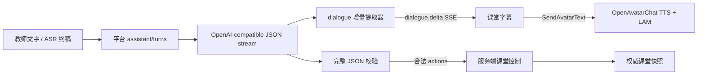

# 数字人课堂控制协议

`edu.classroom.control/1.0` 是数字人、智能体编排层与课堂运行时之间的受控
JSON 协议。它只暴露明确的课堂动作，不允许数字人执行任意脚本、访问 DOM、
结束课堂或修改系统设置。

## 接口

获取当前课堂状态和机器可读能力清单：

```http
GET /api/class-sessions/{sessionId}/avatar/control/capabilities
```

执行一个或多个动作：

```http
POST /api/class-sessions/{sessionId}/avatar/control
Content-Type: application/json
```

完整请求示例：

```json
{
  "protocol": "edu.classroom.control",
  "version": "1.0",
  "requestId": "lam-20260729-0001",
  "reason": "教师要求进入模拟实验",
  "actions": [
    {
      "type": "activity.switch",
      "activity": "simulation"
    }
  ]
}
```

`requestId` 是幂等键。同一个课堂内重复提交相同 `requestId` 时，服务端返回原
执行结果并设置 `"duplicate": true`，不会再次翻页。

每次请求最多包含 8 个动作，按数组顺序原子执行，课堂运行版本最多增加一次。
接口只接受正在进行中的课堂；非直播课堂返回 HTTP 409。

## 白名单动作

### 下一页

```json
{ "type": "slides.next" }
```

自动切回 Slides，并前往下一页。已经在最后一页时返回 `noop`。

### 上一页

```json
{ "type": "slides.previous" }
```

自动切回 Slides，并返回上一页。已经在第一页时返回 `noop`。

### 跳转到指定页

```json
{ "type": "slides.go_to", "slide": 12 }
```

当前《港口管理概论》课件中，`slide` 只接受 1–108 的整数；能力接口始终返回
当前课件的实际总页数，因此外部客户端不应硬编码上限。

### 跳转到指定课次

```json
{ "type": "lesson.go_to", "lesson": 2 }
```

`lesson` 接受 1–16 的整数。当前已建设映射为第1讲@1、第2讲@37、第3讲@73，
并会自动切回 Slides；第4—16讲尚未建设，服务端返回 `noop` 且不改变课堂状态。
调用方仍应读取能力接口中 `lesson.go_to.parameters.readyLessons` 的实时映射，
不能依赖这份文档自行推算。

### 切换课堂活动

```json
{ "type": "activity.switch", "activity": "simulation" }
```

`activity` 只允许：

- `slides`
- `simulation`
- `whiteboard`
- `video`
- `interaction`

## 返回值

```json
{
  "protocol": "edu.classroom.control",
  "version": "1.0",
  "requestId": "lam-20260729-0001",
  "status": "applied",
  "duplicate": false,
  "executedAt": "2026-07-29T08:30:00.000Z",
  "results": [
    {
      "index": 0,
      "type": "activity.switch",
      "status": "applied",
      "message": "已切换课堂活动为 simulation"
    }
  ],
  "snapshot": {
    "...": "执行后的完整课堂快照"
  }
}
```

调用方必须以返回的 `snapshot` 为准，不应自行猜测页码或活动状态。

## 平台助手 JSON 流

OpenAvatarChat 不再拥有课堂 LLM。平台模型只允许返回一个对象：

```json
{
  "dialogue": "好的，我们进入模拟实验。",
  "actions": [
    {
      "type": "activity.switch",
      "activity": "simulation"
    }
  ],
  "schema": "edu.classroom.assistant.response",
  "version": "1.0"
}
```

提示词要求 `dialogue` 成为第一个键。平台的增量状态机能处理任意网络分块、
JSON 转义和 Unicode 代理对；进入顶层 `dialogue` 字符串后立即输出已解码字符，
但不会输出键名、`actions`、协议字段或嵌套字符串。

平台提示词按“固定 JSON 协议 → 航次档案 → 当前讲知识包 → 当前页叙事上下文 →
最近 6 轮历史 → 用户输入”组装。页级上下文包含稳定 `slideKey`、航次位置、
故事阶段、未决问题和证据状态，并从标题、正文、数据、表格、课堂问题与来源中
按需生成。教师使用的 `teachingCue` 不会原样送入模型，只有经过审核的
`assistantCue` 会成为本页回答约束。第4—16讲没有知识包时不得生成虚假课程内容。

模型必须把页面内容区分为 `真实资料`、`教学情境` 或 `概念模型`。回答教学情境时
必须说“在本教学情境中”，不得把重庆教学集装箱、中断、绕航或港口诊断改写为
OOCL Spain 的真实货物、事故或实时班期。



调用接口：

```http
POST /api/class-sessions/{sessionId}/assistant/turns
Content-Type: application/json
Accept: text/event-stream

{"text":"请进入模拟实验","source":"text"}
```

SSE 事件依次可能为 `turn.started`、若干 `dialogue.delta`、
`control.result` 和 `turn.completed`。错误以 `turn.failed` 结束。

低延迟播放与控制信任是两个不同阶段：`dialogue` 可以在对象闭合前进入字幕和
TTS；任何动作必须等完整对象通过严格 Schema 校验后，才由平台服务端生成
`edu.classroom.control/1.0` 请求。若尾部 JSON 无效，前端中断剩余 TTS，且不会
执行任何动作。

## 安全边界

- 助手响应和控制对象均采用严格校验，额外字段会被拒绝。
- 浏览器永远拿不到“执行任意模型 JSON”的权限；控制在平台 API 内完成。
- TTS 只接收 `dialogue.delta`，不接收模型原始流。
- 没有任意 URL、脚本、DOM 选择器或自由方法名。
- 不提供结束课堂、修改设置、邀请学生等高影响动作。
- 每个请求最多 8 个动作，并保留最近 100 个幂等回执。
- 前端收到响应后使用服务端快照更新，不直接改写局部状态。
