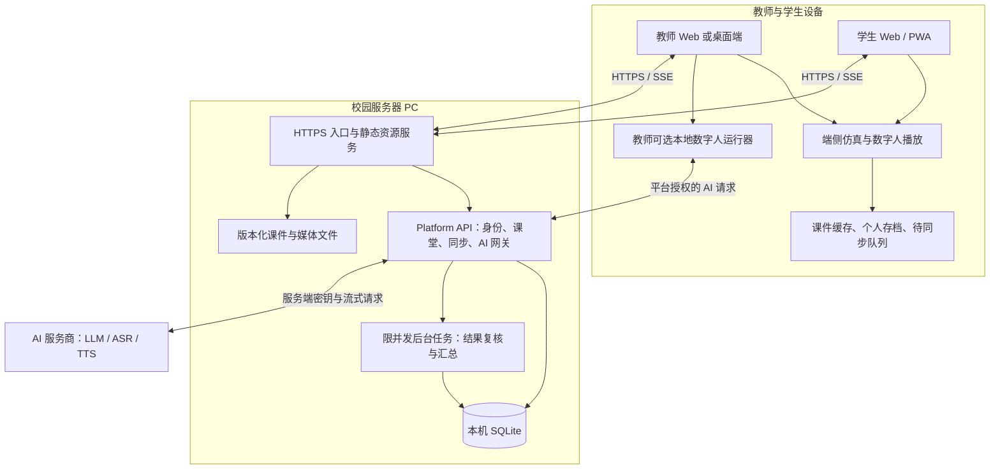

# 校园网单 PC 服务端与端侧教学运行架构建议 v1

日期：2026-09-08。状态：设计提案；其中校园部署一期已实施，实际范围和验收结果见 [当前架构](../architecture.md) 与 [部署说明](../campus-deployment.md)。本文保留可选扩展设计，不将所有提案条目视为已完成。尚未进行实际校园网络和服务商配额验收。

本方案根据当前工作区代码核对，包含尚未提交的现有开发成果。假设一期部署一台 PC、一位教师和约 70 名学生；学生以普通电脑为主，同时为手机和平板提供轻量模式。人数、终端能力、校园 VLAN 与服务商配额仍需部署时确认。这里的频率和容量均为设计起点，不是实测承诺。

## 1. 核心决策

采用“端侧运行与缓存 + 校园服务器保存正式记录、协调课堂及代理 AI + 服务商完成云端推理”。分离的是职责、资源和可部署组件，代码继续保留在一个 monorepo 中。

服务器使用 HTTPS Web 服务。FTP 不承担网页运行、身份验证、课堂实时通信或业务同步；管理员若需要批量导入文件，可以另设受控的 SFTP 导入通道，文件通过校验和发布后再进入课件库。SFTP 与 FTP 是不同协议。Chrome 已移除 FTP URL 支持，浏览器教学入口应使用 HTTPS。[Chrome 官方说明](https://developer.chrome.com/blog/chrome-88-deps-rems)

服务器承担轻量业务计算，例如权限检查、提交去重、计分复核、进度汇总和课堂命令裁决；仿真逐帧推进、3D 渲染和数字人本地推理放在终端。课堂管理的事实来源仍是服务器。

## 2. 部署拓扑

本地运行器仅为具备相应硬件的设备启用。其与浏览器的连接需要经过认证的本机桥接；图中并不表示任意网页可以直接操作本地服务。

| 能力 | 教师/学生终端 | 校园服务器 | 外部服务商 |
| --- | --- | --- | --- |
| Slides、视频、三维场景 | 解码、交互、渲染、缓存 | 分发已发布资源 | 无运行依赖 |
| 个人仿真 | 时钟、规则、状态、动画、本地诊断分数 | 发布任务、存档同步、正式提交与低频复核 | 无运行依赖 |
| 课堂控制 | 教师发起，学生接收并呈现 | 鉴权、排序、记录、广播 | 无 |
| 作答与进度 | 本地先保存，显示同步状态 | 正式记录、归属、版本冲突与汇总 | 无 |
| AI 问答 | 输入与结果呈现 | 上下文、密钥、配额、排队、流式转发 | 模型推理 |
| 动态语音 | 采集、播放、可选本地语音能力 | 云端 ASR/TTS 请求代理与限额 | ASR/TTS 推理 |
| 数字人 | 轻量动作/口型/渲染，教师可选本地推理 | 资源发布、会话与权限信息 | 如选用云语音则按上述路径 |

## 3. 一期服务端组成

一期采用一个 HTTPS 入口进程、一个 Platform API 进程，以及按需启动的限并发任务进程。实时通道和 AI 网关先作为 API 内模块，通过边界与队列隔离负载；后续依据实际阻塞、内存和连接指标决定是否独立进程。

- HTTPS 入口：可使用 Caddy 或学校现有反向代理。直接发送构建后的网页和资源文件，处理压缩、Range 请求、缓存头、HTTPS、SSE 和必要的 WebSocket 升级。
- Platform API：身份、课程、课堂、学习记录、同步协议、AI 网关。CPU 密集任务不在 HTTP 请求处理线程里执行。
- SQLite：课程配置、账号映射、课堂、作答、同步回执、AI 用量与任务记录。数据库位于服务器本机 SSD；所有终端通过 API 访问。
- 文件目录：课件、模型、音频、视频、提交附件与备份。数据库只保存元信息、归属、版本、哈希和路径，不保存大段媒体 Base64。
- 后台任务：正式仿真提交复核、汇总、导出。持久化任务状态并限制并发，优先保障课堂请求。

当前 JSON 开发存储逐步迁移到 SQLite 事务表，避免每次进度变化重写完整平台状态。沿用已有 SQLite 能力，首次不引入 Redis、MinIO、独立实时网关或 Kubernetes。多人多班并发达到单机瓶颈后，可替换存储适配器为 PostgreSQL，再决定其他拆分。

SQLite WAL 支持读写并行，但同一个数据库同一时刻仍只有一个写者，因此必须用短事务、索引、合并写入和有限重试；数据库不可放在网络共享盘或通过文件同步软件实时同步。[SQLite WAL 官方说明](https://www.sqlite.org/wal.html)

对“已正式提交”的回执，应在相应数据库事务按选定耐久策略提交后返回。不能仅进入内存队列便显示成功；成绩等关键提交建议采用更强的同步耐久设置并实测延迟。备份采用一致性备份方式，并验证恢复，不能只复制运行中的主数据库文件而忽略 WAL。

## 4. 端侧应用与内容发布

学生默认用浏览器/PWA，打开校园网地址即可使用。PWA 负责可安装入口和离线能力；它不会自动赋予本地 Python、CUDA 或任意文件访问能力。

教师使用相同的浏览器基础能力。需要本地 GPU 数字人时，提供可选桌面端/本地运行器包；一般学生无需安装这套环境。

仿真核心保留为纯计算包：不读取服务器数据库，不包含服务商密钥，时间和随机种子显式注入。逐步把本地计算放入 Web Worker，UI 只处理交互与绘制。后台标签页按活动规则暂停或恢复，不假定后台计时精确。

课程发布形成不可变 manifest：`courseId`、`releaseId`、资源哈希、大小、必需/可选标记、仿真引擎版本、场景版本、题目版本、语音/角色版本。课堂开始时锁定 releaseId，完整下载并校验新版本后才切换，避免课中混用代码和数据。

教师材料与学生材料使用独立发布清单。教师讲稿、assistantCue、未公开答案、后台配置不仅不能渲染进学生 DOM，也不能进入学生可下载的 JS、JSON、Source Map 或预缓存包。需要权限的文件经身份检查后发送，不能仅依赖难猜的路径。现有 1600×1000 课件画布及逐页审核规则保持适用。

对于平台自己审核的仿真包，可先维持现有组件交付；未来接入独立插件时建立 iframe 和受限 SDK 边界。隔离运行器通过宿主请求内容与同步，避免额外 origin 产生零散缓存和权限问题。

## 5. 缓存与离线

| 数据 | 放置位置 | 建议策略 |
| --- | --- | --- |
| 页面壳和已发布课程必需资源 | Service Worker + Cache Storage | 按发布版本预缓存，已校验资源优先读取本地 |
| 模型、视频、角色素材 | Cache Storage；大文件按需考虑 OPFS 或桌面目录 | 分层下载、支持恢复、校验哈希、设配额 |
| 个人存档、练习草稿 | IndexedDB | 按身份、课程、版本、运行隔离，事务写入 |
| 待同步事件与回执 | IndexedDB | 本地持久化队列；服务器确认后推进状态 |
| 登录、权限与正式成绩 | 服务器 | 每次在线访问鉴权，敏感 API 不进入公共离线缓存 |
| 已审定公共讲解及 TTS | 服务器资源库 + 端侧缓存 | 文本/模型/声音/版本共同确定缓存键 |
| 私人 AI 对话 | 独立个人存储与受控服务端记录 | 默认不跨用户共享缓存 |

提供“下载本节课”和缓存就绪状态：显示必需资源已完成多少、剩余大小、存储空间和是否具备离线运行条件；不能只根据 manifest 已下载就标记整节课可离线。优先下载课件与仿真基础包，再下载高分辨率素材。课前错峰预热，课中降低大文件下载优先级。

浏览器存储存在配额、回收及用户清理行为；请求 `navigator.storage.persist()` 后要读取是否获批，不能承诺永久保存。提供存档导出与导入，未同步记录不得由应用自己的缓存清理流程删除。[MDN 存储说明](https://developer.mozilla.org/en-US/docs/Web/API/Storage_API/Storage_quotas_and_eviction_criteria)

首次登录及首次完整下载需要连接校园服务器。资源就绪后，暂时断网可继续已授权范围内的课件、个人仿真和本地草稿。服务器不能在完全离线时即时撤销已下载内容；离线许可有效期和共享机退出清理需要明确。重新联网提交时必须重新鉴权。

不要依赖浏览器关闭后的后台补传必然发生。页面启动、恢复可见、网络恢复和用户点击同步均可触发重试，页面运行期间适度轮询待同步队列。界面区分“已保存在本机”“待同步”“服务器已接收”“正式评定完成”。

## 6. 课堂通信与可靠同步

保留现有 SSE 路线：客户端用 HTTPS 命令接口上行，服务器用一条复用的 SSE 连接下行课堂事件、在线状态与同步通知。音频双向流等确有需要的模块使用 WebSocket。不要为每个组件各建长连接。

| 信息 | 设计起点 | 权威规则 |
| --- | --- | --- |
| 翻页、活动切换、发布题目 | 事件发生立即发送 | 教师权限检查、服务器版本号与顺序 |
| 在线状态 | 20–30 秒并附加随机抖动 | 只表示近期连接，不作为成绩 |
| 学习进度 | 15–30 秒合并一次，重要节点尽快同步 | 依业务规则合并，不按客户端时间直接覆盖 |
| 个人仿真 | 全部本地推进，检查点示例 30–60 秒且仅有变化时上传 | 每次运行独立；提交复核后产生正式结果 |
| 正式作答/提交 | 尽快发送，失败保存待重试 | 幂等回执、事务持久化、服务器接收时间 |
| 图形帧、骨骼帧、镜头姿态 | 不做全班高频同步 | 每台终端自行绘制 |

上述同步是拟新增能力；现有 V1.0 仿真不上传过程或成绩。实施时要形成明确的新同步契约和用户可见行为，不可把此前的纯本地存档静默当成已同步记录。

建议事件信封：`eventId`、`deviceId`、`sessionId`、`activityId`、`runId`、`clientSequence`、`baseRevision`、`releaseId`、`occurredAt`、`payload`。actorId 由服务器登录会话解析，不能信任客户端自报。服务器补充 `serverSequence` 和 `receivedAt`。

客户端采用至少一次重试；服务器以身份/运行作用域内的 eventId 或 requestId 唯一约束去重，实现一次业务效果。每批给出逐条成功、重复、冲突或拒绝回执，不能整体清空尚未确认的队列。网络中断采用指数退避与随机抖动；重连先补事件，历史已压缩则获取检查点。不能把“浏览器 online”当作校园服务器或 AI 服务商一定可达。

不同数据采用不同冲突规则：

- 教师课堂控制：服务器排序；过期课堂和旧 baseRevision 的控制命令拒绝，不能断网后自动重放旧翻页。
- 已完成页面集合：按相同发布版本合并；最后阅读位置单独记录，不能简单取最大页码。
- 练习草稿：相同版本可进行版本检查；跨设备冲突保留分支供用户选择。
- 仿真存档：按 runId 隔离；同一运行产生分叉时保留两个分支，不合并物理状态或混接事件。
- 正式作答：追加提交/修订记录；延迟补交按课堂规则标记，离线客户端时间不能作为可靠截止时间证明。

## 7. 仿真结果与多人协同

个人练习继续以 local_solo 为默认：终端计算全部仿真，只同步检查点、关键记录和最终提交。上传包应含服务器下发的任务实例、引擎/场景/题目版本、随机种子、操作事件与结果摘要。

正式成绩进入低并发复核队列，服务器用相同确定性核心复算；限制日志字节数、事件数量、模拟时长、执行时间和内存，防止大提交拖住课堂。结果经过复核后才成为服务器认证成绩。公开引擎不应包含需要保密的测验答案；评定规则按课程公开范围发布。

哈希只能帮助验证一致性；服务器复算验证“这串操作得到这个结果”，不能证明由本人完成或排除事先构造。高要求考核需要单独明确身份、任务分发、时间及监考规则。

如果后续需要同组实时协同，服务器至少负责权限、命令序列、冲突及少量权威规则检查，终端回放和渲染。单纯转发客户端自报状态不能保证多人一致。第一期不增加学生主机选举或 P2P 协调；既有 network_teams_legacy 与新个人同步分别标明协议及支持状态。

## 8. 数字人端侧运行

数字人拆成四段：语言理解/生成、语音识别/合成、动作/表情驱动、视觉渲染与播放。把人物显示在浏览器里，只证明渲染在端侧，不代表上游模型已经在本地推理。

| 终端档位 | 建议默认表现 | 是否启动本地模型 |
| --- | --- | --- |
| 手机、低配置电脑 | 文字 + 音频 + 二维角色/短动作循环 | 否 |
| 普通教师和学生电脑 | 轻量三维角色或现有动画播放器、音频驱动口型 | 不强制；按实测渲染能力切换 |
| 有合适 GPU 的教师电脑 | 可选 OpenAvatarChat/LAM 本地运行器 | 是，独立环境和模型目录 |

固定讲解在备课时生成并审定，发布为音频、字幕和动作资源；课堂只下载和播放。动态问答由服务器取得文字/TTS，终端呈现。浏览器语音功能是否离线必须逐设备验证，不能把所有浏览器自带识别/声音视为可靠的离线服务。

当前 Vite 的 `/openavatarchat-runtime` 代理固定连接开发服务器自身 `127.0.0.1:8282`。将网页部署到校园服务器后，这个地址仍指服务器，不会自动指向教师电脑。因此必须明确分开：`campusApiOrigin` 指向校园服务器；`localAvatarRuntime` 由当前设备发现或配对。

浏览器/PWA 的本机运行器连接需处理跨源、HTTPS、浏览器本地网络权限、Origin 校验和一次性配对令牌；不能直接把代理地址改成 localhost 就宣称完成。教师桌面壳与本地运行器通过受控 IPC 或经过认证的桥接连接更容易约束边界。运行器只监听回环地址，不向校园网开放无鉴权推理接口。

本地运行器内凡是调用云端 ASR/TTS/LLM 的适配器，同样改走校园 AI 网关。学生与教师客户端均不保存服务商长期 API Key。教师端运行器故障只降级角色呈现，不中断课堂翻页与学生作答。

## 9. AI 网关

请求路径：客户端 → 校园身份验证 → 课程/课堂授权 → 配额预留 → 教学上下文组装 → 有界队列 → 服务商 → 流式回传与实际用量结算。

- 长期密钥只保存在服务器受保护配置中；前端构建、课件、日志、下载包和本地运行器不含该密钥。
- 服务商地址、模型和工具由服务器配置白名单；浏览器不能传任意上游 URL。教师控制工具与学生问答分别授权，模型输出不是操作权限。
- 按学生、教学班、教师及全局设置并发、请求频率、token/时长和预算上限。教师课堂请求保留一定容量，学生队列公平调度；队列满时给出明确提示和重试时间。
- 区分 LLM、ASR、TTS 的配额。不要因一项尚有余量而认为其他流量不限量。
- 流式代理边收边发，限制缓冲和单请求大小；客户端取消应尝试中断上游。对限流和故障有限退避，不无限重试；已有输出的请求及状态未知的付费请求不能盲目重发。对重复 requestId 返回既有状态，避免重复计费。
- 已审定公共讲解/TTS 按内容、课程版本、模型和声音版本缓存；同一资源的并发生成可合并。私人问答隔离缓存，课堂最新状态和个体上下文不能套用公共答案缓存。
- 教学材料按课程版本预先切分和索引，按需检索少量相关片段。先采用结构化课程定位或轻量检索；如确需 embedding，在备课阶段计算，不在全班课中同时建立索引。
- 只上传问答必要的课程片段和学生输入，日志默认记录请求标识、耗时、状态和用量；对话与录音的存储范围、保留期和删除入口另行明确。

AI 代理主要消耗网络和连接资源，但上下文处理、大音频缓冲和日志也可能占用 CPU/内存。不要承诺 AI 转发“没有负载”。固定内容缓存主要减少重复下载和重复生成，不能让所有新的个性化问答免费或离线可用。

## 10. 校园网与服务运维

- 申请固定内网地址或 DHCP 保留地址，配置稳定域名。稳定 origin 同时影响缓存、Cookie 与本地记录的可复用性。
- 学生 VLAN/Wi-Fi 必须能到达服务器 HTTPS 端口；服务器必须能访问服务商。相同校园网名称不保证不同楼宇、无线客户端或 VLAN 之间互通，须从真实教室终端验证。
- 配置受终端信任的 TLS 证书，优先复用学校域名/证书体系。普通局域网 IP 的 HTTP 不满足 Service Worker 安全上下文要求；localhost 的开发例外不能推广到远程校园 PC。[MDN Service Worker 说明](https://developer.mozilla.org/en-US/docs/Web/API/Service_Worker_API)
- 入口监听校园接口，API 继续绑定本机回环并由入口代理。学生仅访问 HTTPS；不开数据库、开发服务器或 GPU 服务端口。SSE 关闭代理缓冲，配置心跳、超时及游标恢复。
- Windows 一期可使用原生服务托管；设置开机启动、崩溃恢复、禁止上课期间休眠和安排更新窗口。无需为了部署强制增加虚拟化层。
- 上课前执行预检：证书、资源版本、缓存状态、数据库可写、SSE、服务商额度、磁盘空间。监测 CPU、内存、事件循环延迟、磁盘延迟、出口流量、未同步量、AI 队列和错误率。
- 定期一致性备份到另一存储位置，并实际演练恢复。单 PC 仍是登录、同步和 AI 的单点；缓存降低教学中断程度，不等于具备高可用。

## 11. 容量估算与故障行为

初始候选配置可按现有 4–8 核 CPU、16 GB 内存、SSD 和千兆有线连接进行单班试点，不据此承诺支持人数。优先测校园 Wi-Fi 和首次资源分发，再测 API。无需为只做代理与记录的服务器配置推理 GPU。

计算示例采用十进制单位，未计协议开销：

- 70 人每 20 秒上传 2 KB 摘要：平均约 3.5 次请求/秒、7 KB/秒负载。同步需错峰，否则仍会形成瞬时峰值。
- 70 人各下载 300 MB 资源：合计 21 GB；100 Mbps 链路理论下限约 28 分钟，1 Gbps 理论下限约 168 秒。实际还受无线竞争、磁盘、协议和校园限制影响，所以课前预缓存非常关键。
- 70 个 AI 请求同时到达，假设仅允许 10 个并发、每个占用 20 秒：简化估算需要 7 批，最后一批约在 120 秒后开始、140 秒结束。此例不包含 token/RPM/TPM 约束；最终取决于服务商模型、配额和真实耗时。

| 故障 | 期望行为 |
| --- | --- |
| 外网/服务商不可用，校园服务器可达 | 缓存课件、仿真、课堂同步与提交继续；动态 AI 显示暂不可用 |
| 学生到服务器断线 | 已缓存课件、个人仿真与草稿继续；跨设备同步和课堂指令暂停，记录待补传 |
| 校园 PC 关闭或重启 | 同上；已提交记录按恢复流程重建，重连取得课堂快照，过期控制不重放 |
| 浏览器存储不足/缓存被清理 | 明确缺失资源与受影响存档，允许重新下载/导入；不能承诺恢复从未上传的记录 |
| 本地数字人不支持或崩溃 | 降级音频/文字/轻量角色，教学主体可继续 |

## 12. 与当前项目的对应关系

以下是源码和项目文档核对结果，不是本次运行或性能验收结果。

| 当前位置 | 已有基础 | 拟改造方向 |
| --- | --- | --- |
| `apps/teacher-web` | React/Vite，教师/学生课堂与课下学习页面 | 共享代码，按教师/学生形成独立入口及发布物；增加 PWA 和设备档位 |
| `packages/port-simulation-core` | 无 UI/I/O 的确定性核心 | 保留端侧运行，加入受限后台复核适配器 |
| `features/port-simulation/local-port-simulation.ts` | localStorage 存档与个人历史 | 迁移 IndexedDB，补版本化检查点与同步队列 |
| `apps/platform-api` | Fastify、SSE、AI 流与部分角色检查 | 模块化单体，补齐生产身份、所有业务路由授权、同步、AI 配额 |
| `src/store.ts` | 平台 JSON 开发存储 | 分批迁入事务型 SQLite 仓储 |
| `src/port-simulation-event-repository.ts`、`src/classroom-participation.ts` | 本地 SQLite 记录能力 | 复用事务/迁移经验，保留旧协议边界 |
| `src/identity.ts`、`src/server.ts` | 开发身份 Provider，生产默认禁止开发身份 | 接校园统一身份或教师发放账号；不能用生产开启开发身份代替接入 |
| `teacher-web/vite.config.ts`、`src/avatar-runtime.ts` | OpenAvatarChat 指向部署主机地址 | 区分校园 API 与当前设备本地运行器 |
| `components/openavatarchat` | Python/GPU 模型及其依赖 | 制作可选教师端安装包，默认不进入校园服务器部署包 |
| `packages/contracts`、`packages/course-content` | 共享契约与课程内容 | 增加同步信封和发布 manifest，严格区分学生内容与教师私有字段 |

当前默认身份仍是 DevelopmentIdentityProvider，部分旧入口如 `/api/me` 仍直接返回种子教师；不能把现有“有角色检查”视为全平台生产认证已经完成。未发现主应用的 Service Worker/IndexedDB 接入；本地 localStorage 存档只表示数据留在当前浏览器，不能等同于完整离线启动或云同步。

仓库建议保留现有 apps 和 packages；确实进入实现时才新增 `apps/student-web`、`packages/client-sync`、`packages/client-storage`、`packages/avatar-player`、`packages/content-manifest` 等边界。共享包不得把服务器私有配置或教师私有内容带入学生构建。单独提供 server、teacher、student 发布目标，避免校园服务器安装全部模型依赖。

本方案是单 PC 校园部署 profile，细化并收敛现有 `docs/architecture.md` 的多进程/大规模部署设想；它不表示旧文档中的 Redis、PostgreSQL、S3 或独立 GPU 服务已经实现，也不要求一期全部安装。

## 13. 实施顺序与验收

1. **校园网与身份闭环**：完成 HTTPS 发布、固定域名、真实教师/学生身份、路由授权和独立配置；从教室 Wi-Fi 验证登录、翻页、作答及服务器访问 AI。学生包不含密钥和教师私有内容。
2. **课程包与离线底座**：manifest、课前预缓存、IndexedDB、版本锁定、缓存空间与存档导出；浏览器重新打开且服务器不可达时，已下载课程仍能进入并运行，缺失资源明确提示。
3. **可靠同步与持久化**：JSON 数据受控迁移、幂等事件、回执、断线补传、跨设备分叉和一致性备份；模拟“落库成功但回执丢失”、服务器重启、重复提交、存储不足，确认不丢已确认记录、不重复计分。
4. **AI 网关完善**：配额、队列、取消、超时、用量、公共讲解缓存和私人隔离；模拟全班同时提问、429、部分流中断和未知计费状态，课堂控制与作答不被阻塞。
5. **端侧数字人**：先完成通用轻量播放，再交付可选教师本地模型；校园服务器不启动 GPU 组件仍能完成整节课堂。本机桥接在实际浏览器/桌面端验证后才标记可用。
6. **实际课堂容量验收**：使用目标班额进行冷缓存、热缓存、集中提交、AI 突发、网络断开和恢复测试。测量本地交互帧率、控制到达延迟、同步延迟、CPU/内存、磁盘写入、网络吞吐与 AI 队列等待；根据结果确定硬件和并发上限。

本次仅形成架构建议并核对源码依据；没有修改应用运行行为，没有运行生产构建、课程审查或负载测试，也未宣称以上拟新增能力已完成。
