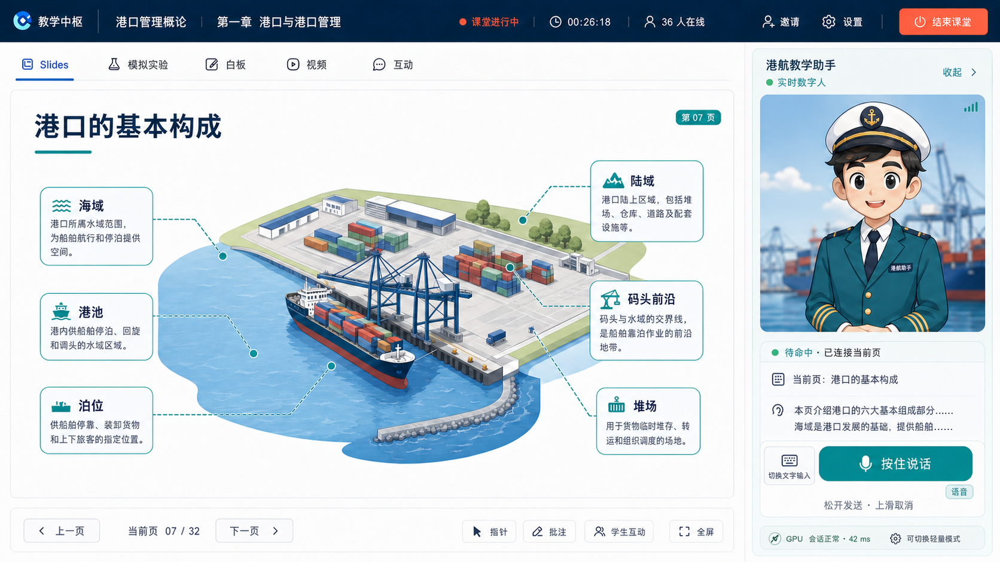

# 教学页面规划 v1

> 历史概念稿：保留用于追踪设计演进，不代表当前已实现页面。图中的装饰性在线人数、
> 卡通头像和推测性 GPU 状态均已被否决。当前真实实现与验收证据见
> [`../classroom-subsystem.md`](../classroom-subsystem.md)。
>
> 页面定位：教师端实时授课控制台
> 适用课程：港口管理概论
> 教师：李行之 · 重庆交通大学
> 设计原则：教学内容是主舞台，数字人是按需出现、随时可收纳的课堂助手。

## 概念图

历史交互概念：



- [`classroom-page-concept-v2.png`](classroom-page-concept-v2.png)：历史方案，数字人控制区改为手动语音/文字指令输入器，但尚未替换其中的装饰数据与卡通头像。
- [`classroom-page-concept-v1.png`](classroom-page-concept-v1.png)：历史方案，保留“讲解当前页/暂停讲解”按钮。
- 生成提示词与设计约束见 [`classroom-page-imagegen-prompt-v2.md`](classroom-page-imagegen-prompt-v2.md)。

## 1. 核心决策

1. 桌面端默认采用约 `78% : 22%` 的主内容与数字人分栏。
2. 数字人侧栏不是独立聊天应用，只围绕“当前课程版本、当前章节、当前教学活动”工作。
3. Slides、模拟实验、白板、视频和课堂互动都在同一个教学主舞台切换，不为每种活动重新打开页面。
4. 教师必须始终保有暂停、打断、重讲、收起和降级数字人的控制权。
5. 实时数字人只服务当前班级课堂；GPU 不可用时依次降级为“音频 + 卡通动作”和“字幕 + 文本”。
6. 学生端只同步教学内容、教师指针和数字人输出，不显示教师备课备注、控制按钮或 GPU 状态。

## 2. 页面骨架

```text
┌──────────────────────────────────────────────────────────────────────────────┐
│ 课程 / 章节                 课堂状态 · 在线人数 · 计时      邀请  设置  结束 │
├──────────────────────────────────────────────────────┬───────────────────────┤
│ Slides  模拟实验  白板  视频  互动                   │ 港航教学助手 · 实时   │
│                                                      │                       │
│                                                      │   数字人视频画面      │
│             教学内容主舞台（约 78%）                 │                       │
│                                                      │ 状态 / 字幕 / 当前任务│
│                                                      │                       │
│                                                      │ 讲解当前页  暂停  收起│
├──────────────────────────────────────────────────────┤                       │
│ 上一页  07 / 32  下一页  指针  批注  学生互动        │ GPU / 网络 / 降级状态 │
└──────────────────────────────────────────────────────┴───────────────────────┘
```

## 3. 区域与职责

| 区域 | 建议尺寸 | 职责 | 关键操作 |
| --- | ---: | --- | --- |
| 课堂顶栏 | 高 64–72 px | 显示课程、章节、直播状态、计时和在线人数 | 邀请学生、课堂设置、结束课堂 |
| 活动切换条 | 高 48–56 px | 在同一主舞台切换教学活动 | Slides、模拟实验、白板、视频、互动 |
| 教学主舞台 | 可用宽度约 78% | 渲染当前 `ActivityRun` | 翻页、播放、全屏、指针、批注 |
| 舞台控制条 | 高 56–64 px | 控制当前活动，不遮挡教学内容 | 上一页、下一页、页码、批注、发起互动 |
| 数字人侧栏 | 宽 320–380 px | 展示数字人、字幕、任务和运行状态 | 讲解当前页、暂停、打断、收起 |
| 折叠态助手 | 宽 64–76 px | 保留状态和召回入口 | 展开、暂停、查看异常 |

## 4. 教学主舞台

### 4.1 Slides 模式

- 主画面完整显示当前课件页，避免左右缩略图长期占用宽度。
- 页缩略图使用可召回抽屉，默认关闭。
- 底部控制条显示 `当前页 07 / 32`、前后翻页、激光指针、批注与全屏。
- 教师备注通过私有抽屉打开，永远不广播到学生端。
- 数字人讲解绑定 `deckVersionId + slideId + animationStep`，防止讲错页面。

### 4.2 模拟实验模式

- 自研模拟器在同一主舞台沙箱运行。
- 控制条切换为“开始、暂停、重置、下发参数、保存快照”。
- 数字人只播报实验目标、阶段提示和结果解释，不接管实验操作。

### 4.3 互动模式

- 题目、投票、随机点名和讨论卡片覆盖主舞台。
- 互动结束后生成课堂事件，并可以一键回到先前 Slides 页。
- 右侧数字人可读题、倒计时和总结，但教师可立即打断。

## 5. 数字人侧栏

### 5.1 信息层级

1. 顶部：`港航教学助手`、实时/轻量模式、连接状态。
2. 视频区：数字人画面，固定 16:9 或 4:3，不随字幕高度跳动。
3. 当前任务：例如“正在讲解：港口的基本构成”。
4. 实时字幕：最多显示最近 2–3 句，完整记录进入可展开抽屉。
5. 指令输入区：默认显示“按住说话”，可切换文字输入；松开发送、上滑取消。
6. 运行状态：GPU 会话、网络延迟、降级提示；只给教师看。

### 5.1.1 手动语音 / 文字输入器

- 默认采用语音态，主按钮文案为“按住说话”。
- 只有按住期间才采集麦克风，不允许常开收音或后台自动监听。
- 松开按钮发送录音；按住后上滑进入取消区，松开后丢弃本次录音。
- 左侧键盘按钮切换为文字态，主区域变为普通输入框，按 `Enter` 或发送按钮提交。
- 切回语音态时保留尚未发送的文字草稿，但不自动发送。
- 录音态显示时长、实时波形和“松开发送”；超过最大时长时自动停止并等待教师确认。
- 麦克风权限、网络或 ASR 异常必须在输入器附近显示，不能只写入系统日志。
- 语音和文字最终都转化为同一种 `TeacherAvatarCommand`，后续讲解流程不依赖输入方式。

### 5.2 明确状态

| 状态 | 界面表现 | 教师可用操作 |
| --- | --- | --- |
| 未启动 | 静态卡通形象，显示“尚未占用 GPU” | 启动实时助手 |
| 预热中 | 进度与预计等待时间 | 取消、切换轻量模式 |
| 待命 | 轻微呼吸动作，不自动发言 | 讲解当前页、提问引导 |
| 思考中 | 显示问题摘要和取消按钮 | 取消、改为文本回答 |
| 讲解中 | 数字人画面、字幕和进度 | 暂停、停止、重讲 |
| 教师发言 | 自动静音并进入待命 | 教师结束后继续 |
| 降级 | 明确说明当前使用音频/卡通或文本 | 重试实时模式 |
| 异常 | 显示可理解的原因，不暴露底层堆栈 | 重试、收起、继续上课 |

### 5.3 侧栏尺寸策略

- 默认：320–380 px，约占常见 1440/1600 宽屏的 20%–24%。
- 聚焦教学：折叠为 72 px，仅保留头像、状态、暂停和展开。
- 数字人重点讲解：允许临时放大到 32%，讲解结束自动恢复。
- 全屏 Slides：数字人变为右下角画中画，教师可以隐藏。

## 6. 课堂关键流程

### 6.1 开课

1. 教师进入控制台，系统加载已发布课程版本与课堂快照。
2. 学生加入后在线人数实时更新。
3. 数字人默认未启动；教师点击“启动实时助手”才申请 GPU。
4. 预热完成后进入待命，不能自动开始讲话。

### 6.2 让数字人讲解当前页

1. 教师按住说话并发出“讲解当前页”等指令，或切换到文字输入后提交。
2. 语音态先完成收音与 ASR；语音和文字统一形成可审计的教师指令。
3. 系统把教师指令、当前活动、页码、章节目标与引用片段发送给 AI 编排层。
4. 先生成可审计讲解文本，再交给 OpenAvatarChat 呈现。
5. 学生端同步收到数字人音视频与字幕。
6. 教师暂停、翻页或开始讲话时，当前讲解立即停止或挂起。

### 6.3 切换到模拟实验

1. 教师从活动条选择“模拟实验”。
2. 主舞台保存 Slides 状态并载入模拟器。
3. 数字人上下文切换到当前实验目标，但不会自动执行操作。
4. 返回 Slides 时恢复原页码、动画步骤与教师指针。

## 7. 小屏与大屏策略

- `≥ 1440 px`：78/22 双栏，完整数字人侧栏。
- `1024–1439 px`：主舞台优先，侧栏固定 300–320 px，可自动折叠。
- `< 1024 px`：数字人使用画中画或底部抽屉，不压缩 Slides 到不可读。
- 教室大屏：只展示教学主舞台、字幕和可选数字人画中画，不展示教师控制台。

## 8. 无障碍与课堂安全

- 所有数字人语音默认提供字幕，字幕可调字号与对比度。
- 暂停/停止数字人提供固定键盘快捷键，不随页面模式变化。
- 颜色之外还使用文字和图标表达直播、异常与降级状态。
- 网络或 GPU 故障不能阻塞翻页、模拟实验或课堂互动。
- 结束课堂需要二次确认，同时保存当前活动状态与事件记录。

## 9. 建议接口边界

- `GET /api/class-sessions/:id/snapshot`：课堂当前快照。
- `POST /api/class-sessions/:id/events`：翻页、活动切换、批注和互动事件。
- `POST /api/class-sessions/:id/avatar-session`：按需申请实时数字人会话。
- `POST /api/avatar-sessions/:id/cues`：讲解当前页、提示或总结。
- `POST /api/avatar-sessions/:id/pause`：暂停/继续。
- `DELETE /api/avatar-sessions/:id`：停止并释放 GPU。
- WebSocket：在线人数、页码、活动状态、字幕和数字人状态增量。

## 10. 第一版验收标准

1. 进入页面后教学主舞台明显大于数字人区域。
2. Slides 能翻页、全屏、指针和批注，刷新后恢复课堂状态。
3. 数字人未启动时不占用 GPU；启动、暂停、停止和降级都有明确反馈。
4. 切换 Slides、模拟实验和互动时不离开课堂路由。
5. 教师发言或翻页能可靠打断数字人。
6. 关闭数字人服务后，教师仍能完成整节课。
