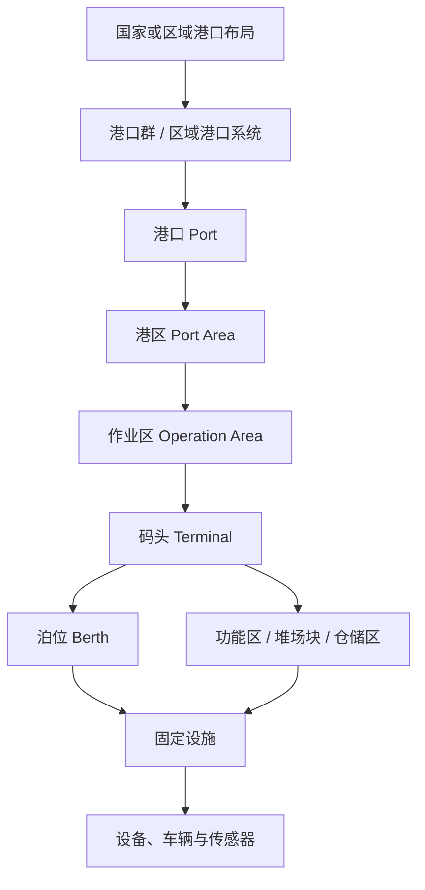
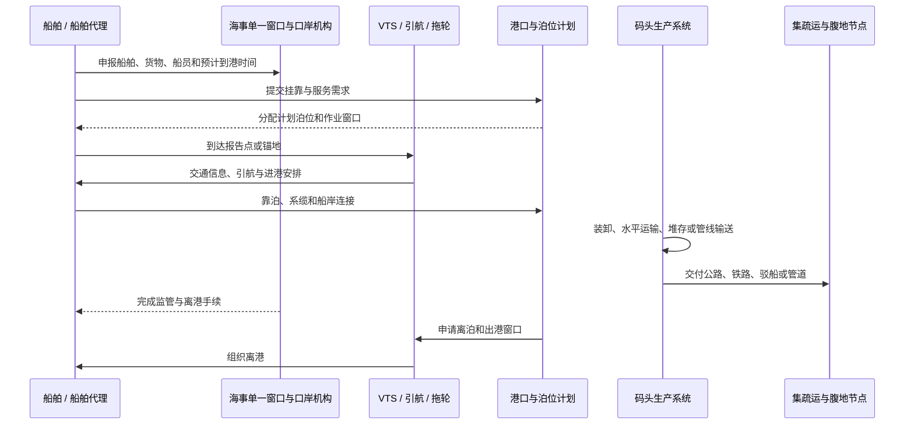

# 港口仿真领域框架与对象清单 v0.1

> 状态：Domain Research Baseline v0.1
>
> 更新日期：2026-07-31
>
> 适用范围：港口仿真独立组件、港口管理课程可视化、后续场景与仿真数据建模
>
> 当前实现：`apps/teacher-web/src/features/port-simulation`

## 1. 文档目的

本文建立港口仿真项目的统一领域语言和对象母清单，回答四个层次的问题：

1. 港口在全球航运网络和区域经济中处于什么位置。
2. 港口、港区、码头、泊位、水域、陆域、前陆和腹地之间是什么关系。
3. 港口内部通常有哪些空间、设施、设备、人员、货物、流程和数字系统。
4. 这些概念在仿真软件中应如何表达，哪些属于几何场景，哪些属于业务状态。

本文是教学和软件设计所需的领域研究基线，不是港口工程设计文件、航海资料、导航图或生产调度规程。具体港口的边界、设备数量、能力和安全要求必须以其正式规划、设计文件、港口章程和运行规程为准。

## 2. 核心结论

### 2.1 港口不是单一的码头

《中华人民共和国港口法》第三条将港口定义为具有船舶进出、停泊、靠泊，旅客上下，货物装卸、驳运和储存等功能，具有相应码头设施，并由一定范围水域和陆域组成的区域；一个港口可以由一个或多个港区组成。本文据此把“水域 + 陆域 + 设施 + 活动”作为港口对象的最低完整边界，而不是把港口等同于岸桥、堆场或某一个集装箱码头。[中国人大网：《中华人民共和国港口法》](https://www.npc.gov.cn/zgrdw/npc/xinwen/2019-01/07/content_2070259.htm)

### 2.2 港口是海陆网络接口

港口连接两个方向的网络：

- 海向是由航线、挂靠港和海外市场构成的**前陆**（foreland）。
- 陆向是由货源地、消费地、工业区、物流节点及集疏运通道构成的**腹地**（hinterland）。

UNCTAD将港口描述为航运网络与腹地商业可达性之间的接口，并指出港口还与劳动力、能源、技术、金融和信息网络相互依赖。[UNCTAD：The port interface](https://resilientmaritimelogistics.unctad.org/guidebook/31-port-interface)

### 2.3 港口腹地不是港口陆域

港口陆域位于港界内，主要容纳码头、堆场、道路、仓库、生产辅助和管理设施。腹地通常位于港界外，是使用该港口完成进出口或中转的内陆市场区域。腹地可通过公路、铁路、内河航运和管道与港口连接，也可能与其他港口重叠、竞争，并随货种、运输时间、成本、班列和航线变化而变化。[世界银行：Port Reform Toolkit — Hinterland Connectivity](https://documents1.worldbank.org/curated/en/508771540319329808/pdf/131217-PUB-PUBLIC-publication-date-is-10-23-18.pdf)

### 2.4 通用底座应使用“水域”，而不是只使用“海域”

“海域”适合描述海港外海、沿海和海向网络，但港口也可能位于河流、湖泊或运河。通用数据模型宜使用 `waterArea`、`portWaterArea` 和 `navigationArea`；海港场景再将其具体化为 `seaArea`。这能让同一底座支持海港、河港、河口港、湖港和运河港。

### 2.5 场景、业务状态和动画必须分开

- **场景定义**回答对象在哪里、长什么样、与谁相连。
- **业务状态**回答对象当前是否可用、占用、等待、作业、故障或关闭。
- **动画表现**回答当前如何把状态和运动呈现给用户。

V0.01中的船舶、AGV、岸桥和外集卡动画只属于视觉演示。后续只有在业务模型产生任务、资源分配和状态迁移后，才构成正式仿真。

## 3. 港口的宏观空间框架

```mermaid
flowchart LR
  subgraph foreland["前陆 / 海向网络"]
    overseasMarket["海外市场"]
    overseasPort["海外港口"]
    shippingRoute["远洋、支线与沿海航线"]
    overseasMarket --- overseasPort --- shippingRoute
  end

  subgraph maritime["海域或外部通航水域"]
    openWater["外海、河流或运河"]
    approach["进港航线与引航点"]
    outerAnchorage["港外锚地"]
    openWater --> approach --> outerAnchorage
  end

  subgraph port["港口边界"]
    subgraph water["港口水域"]
      channel["航道"]
      basin["港池与回旋水域"]
      berthWater["泊位前沿水域"]
      channel --> basin --> berthWater
    end

    shoreline["岸线 / 海陆接口"]

    subgraph land["港口陆域"]
      terminal["码头与作业区"]
      yard["堆场、仓库与储罐"]
      gate["闸口与集疏运接口"]
      service["管理、服务与公用设施"]
      terminal --> yard --> gate
      service --- terminal
    end

    berthWater --> shoreline --> terminal
  end

  subgraph hinterland["腹地 / 内陆市场网络"]
    corridor["公路、铁路、内河与管道走廊"]
    inlandHub["内陆港、物流园与铁路枢纽"]
    production["生产地、消费地与城市群"]
    corridor --> inlandHub --> production
  end

  shippingRoute --> openWater
  outerAnchorage --> channel
  gate --> corridor
```



这张图表达两个重要边界：

1. 港口水域和港口陆域共同位于港口边界内。
2. 前陆与腹地属于港口的功能联系范围，但通常不属于港界本身。

## 4. 宏观概念词典

| 概念 | 工作定义 | 是否通常位于港界内 | 仿真建模建议 |
| --- | --- | --- | --- |
| 港口 `Port` | 由一定水域、陆域、码头设施和港口活动共同构成的区域与组织系统 | 是 | 作为场景、规则和统计的顶级业务对象 |
| 港口系统 `PortSystem` | 港口及其航运、集疏运、物流、产业、治理和信息网络的整体 | 跨越港界 | 作为跨场景网络，不直接等同于一张地图 |
| 港口群 `PortCluster` | 在同一区域内分工、协同或竞争的多个港口 | 否 | 顶层区域网络，可包含多个 `Port` |
| 港区 `PortArea` | 一个港口内部相对独立的地理和功能片区 | 是 | 作为港口下一级空间容器 |
| 作业区 `OperationArea` | 港区内面向特定货类、流程或经营主体的作业片区 | 是 | 可包含一个或多个码头、堆场和辅助区 |
| 码头 `Terminal` | 面向某类船舶、货物或旅客，完成装卸、换装、储运和服务的生产系统 | 是 | 不应只表示一段岸线，应同时包含前沿、堆场和集疏运接口 |
| 泊位 `Berth` | 可供一艘设计船舶靠泊并接受服务的位置 | 是 | 具有长度、水深、兼容船型、占用状态和服务能力 |
| 岸线 `Shoreline` | 水域和陆域之间可被保护、利用或开发的界面资源 | 是或邻接港界 | 建模为线性资源，并关联泊位、护岸和岸线使用功能 |
| 海域 `SeaArea` | 海港所在的广义海洋空间，可包括外海、沿海、海湾和岛屿周边水域 | 不一定 | 仅用于海港场景；不要替代通用 `WaterArea` |
| 港口水域 `PortWaterArea` | 港界内用于进出、锚泊、回旋、靠泊、过驳及其他港口活动的水域 | 是 | 包含航道、港池、锚地、回旋区和泊位前沿水域 |
| 陆域 `PortLandArea` | 港界内支撑码头生产、储运、交通、管理和服务的陆地区域 | 是 | 包含码头、堆场、仓库、道路、铁路、建筑和公用设施 |
| 港界 `PortBoundary` | 港口水域和陆域的规划或管理边界 | 边界本身 | 使用多边形或多多边形表示，必须与视觉海岸线分开 |
| 前陆 `Foreland` | 通过海上航运服务与港口连接的其他港口和海外市场网络 | 否 | 以航线网络、挂靠关系、频次和运力表达，不宜只画成海面面积 |
| 腹地 `Hinterland` | 使用该港口发送出口货物或接收进口货物的内陆市场及货源区域 | 否 | 既可表达为分区，也要表达公路、铁路、内河和内陆节点网络 |
| 集疏运 `HinterlandTransport` | 货物和旅客在港口与腹地之间集结、疏散的运输系统 | 跨越港界 | 建模为道路、铁路、内河、管道及其班次、能力和拥堵状态 |
| 临港产业 `PortCentricIndustry` | 因依赖港口物流、能源或岸线资源而在港口附近布局的生产活动 | 港界内外均可能 | 作为货流产生和消费节点，而不是码头附属装饰 |
| 港城界面 `PortCityInterface` | 港口与城市在土地、交通、环境、就业和公共空间上的交互地带 | 跨越港界 | 表达交通冲突、环境影响、缓冲带和城市服务关系 |

### 4.1 “港域”的使用说明

“港域”在不同港口规划和地方命名中可能指一个大型港口内部的宏观地域单元，也可能只是对港口水陆范围的概括，并不是所有资料都采用相同层级。为避免数据模型含义漂移：

- 内部接口优先使用 `port`、`portArea`、`operationArea` 和 `terminal`。
- 若具体规划公开名称中使用“某某港域”，可把它作为 `portArea` 的公开标签或增加显式 `planningRegion` 类型。
- 不要仅凭名称推断其行政权属、经营主体或工程边界。

## 5. 前陆、海域、港口、陆域和腹地

### 5.1 前陆：港口的海向服务网络

前陆不是“港口前面的一片海”，而是港口通过航运服务连接的其他港口和海外市场。世界银行和港口经济研究通常从海外目的港、航线、挂靠频次和运力理解前陆。[Port Economics, Management and Policy：Port Dimensions](https://porteconomicsmanagement.org/pemp/contents/introduction/defining-seaports/port-dimensions/)

前陆至少包含：

- 远洋主干航线、区域航线、沿海航线和支线网络。
- 海外港口、枢纽港、支线港和中转港。
- 航线联盟、班轮服务、挂靠顺序、班次和运力。
- 海上运输距离、航行时间、航线绕行和拥堵。
- 海峡、运河、关键水道和其他网络瓶颈。
- 海向货源地、消费地及中转市场。

仿真中，前陆更适合表达为网络图或远景层，而不是与港内总图使用同一比例尺。

### 5.2 海域与外部通航水域

海域是海港所处的广义自然和交通空间。对于河港，相同位置由河流、湖泊或运河水域承担。它可以包含：

- 外海、海湾、河口、岛屿、河流和运河。
- 国际或国内航线、定线制、推荐航路。
- 海峡、运河、桥区、船闸等瓶颈。
- 港外引航点、报告点和锚地。
- 水深、底质、潮汐、水流、波浪、风、雾和冰况。
- 自然保护区、生态敏感区、渔业水域和海上工程区。
- 海事、海关、边防或其他管理水域。

海域与港口水域可能邻接或部分重叠于某些管理服务范围，但在场景数据中应通过明确边界和管理关系表达，不能把“VTS覆盖范围”直接当成“港界”。

### 5.3 港口水域

港口水域承担船舶安全进出、等待、回旋、靠泊、过驳和接受服务的功能，通常包括：

- 进港航道、出港航道、内航道及航道弯段。
- 港外或港内锚地、待泊锚地、应急锚地和危险品锚地。
- 港池、回旋水域、会让区和船舶操纵水域。
- 码头前沿停泊水域、泊位疏浚槽。
- 过驳水域、浮筒泊位和单点系泊水域。
- 导航、助航、气象、水文和VTS设施服务范围。
- 疏浚区、抛泥区或疏浚物处置关系。
- 限速、禁航、禁锚和安全隔离区。

交通运输部《港口规划管理规定》要求港口总体规划确定港口性质、功能、港区划分、岸线利用、水陆域布置和港界，并在港区详细规划中统筹集疏运、公用工程、安全、口岸和环境设施。[交通运输部：《港口规划管理规定》](https://xxgk.mot.gov.cn/jigou/zhghs/202006/t20200630_3320038.html)

### 5.4 岸线：水域和陆域的转换界面

岸线既是自然地理边界，也是有限的港口资源。它可能承担：

- 码头靠泊和装卸。
- 护岸、防洪、防浪和生态保护。
- 客运、公共服务、渔业、工业或城市滨水功能。
- 远期港口发展预留。

港口岸线使用并不只涉及一条几何线。交通运输部的管理办法明确，港口岸线还包含维持港口设施正常运行所需的相关水域和陆域。[交通运输部：《港口岸线使用审批管理办法》](https://xxgk.mot.gov.cn/2020/gz/202201/t20220110_3635836.html)

因此仿真中的岸线对象宜关联：

- 岸线段长度和功能。
- 相邻水深和设计船型。
- 泊位、护岸、防波堤或生态岸段。
- 相邻陆域纵深和交通条件。
- 当前利用、规划利用和预留状态。

### 5.5 港口陆域

港口陆域是港界内直接支撑港口生产、物流、管理和服务的土地，通常包括：

- 码头前沿作业带。
- 堆场、仓库、筒仓、储罐和物流设施。
- 闸口、道路、铁路、管道和内河换装接口。
- 维修、充电、能源和公用工程设施。
- 港口管理、口岸监管、安全和应急设施。
- 生产生活辅助设施和绿化缓冲带。
- 临港加工或港口物流增值设施。
- 近期建设用地、远期预留地和限制建设区域。

陆域不是简单的“码头下方空地”。其布局需要同时满足货物流线、设备工艺、人车分离、排水、防洪、消防、危险品隔离、环境保护和未来扩展。

### 5.6 腹地：港口的陆向市场网络

世界银行将港口腹地概括为使用该港口向海外发送货物或从海外接收货物的内陆区域，并指出公路、铁路和内河航运是典型腹地连接方式。[世界银行：Hinterland Connectivity](https://documents1.worldbank.org/curated/en/508771540319329808/pdf/131217-PUB-PUBLIC-publication-date-is-10-23-18.pdf)

腹地可以从多个维度划分：

| 维度 | 类型 | 含义 |
| --- | --- | --- |
| 市场控制力 | 核心腹地 | 该港口具有明显综合成本或服务优势的区域 |
| 市场控制力 | 竞争腹地 | 多个港口可争夺同一货源或消费市场的区域 |
| 服务强度 | 主要腹地 | 长期、稳定贡献主要货流的区域 |
| 服务强度 | 次要腹地 | 货流较少、季节性明显或替代港较多的区域 |
| 货种 | 集装箱腹地、煤炭腹地、粮食腹地等 | 同一港口不同货种可能拥有完全不同的腹地 |
| 方向 | 进口腹地、出口腹地 | 同一区域的进出口港口选择可能不同 |
| 运输方式 | 公路、铁路、内河、管道腹地 | 由不同运输网络和成本结构形成 |

腹地边界不是固定行政边界。影响其变化的因素包括：

- 港口和码头的服务能力、价格与可靠性。
- 航线数量、频次、运力和海外连接。
- 公路、铁路、内河和管道的时间与成本。
- 内陆港、物流园、班列和驳船网络。
- 通关、预约、拥堵和货物在港停留时间。
- 货类、批量、时效、温控和危险品要求。
- 产业迁移、消费市场和供应链策略。
- 相邻港口竞争、港口联盟与区域一体化。

仿真系统不应只把腹地保存为一块静态多边形。更合理的表达是“区域节点 + 运输走廊 + 货流关系 + 港口选择规则”。

### 5.7 集疏运系统

集疏运是港口陆域与腹地之间的连接层，负责把出口货物集中到港、把进口货物疏散出港。它包括：

- 港区道路、城市快速路和高速公路。
- 港口铁路专用线、编组站、货运站和班列。
- 内河航道、驳船码头和水水中转。
- 原油、成品油、天然气和化工品管道。
- 内陆港、无水港、物流园和海关监管节点。
- 卡车预约、闸口、称重、查验和车辆缓冲区。
- 公铁、水铁、公水、海铁等多式联运换装节点。

### 5.8 港城界面

港口与城市可能共享或竞争岸线、道路、土地、劳动力、能源和环境容量。港城界面需要关注：

- 港区集卡与城市交通拥堵。
- 港口噪声、灯光、粉尘和空气排放。
- 危险品设施与居住区安全距离。
- 岸线工业利用与公共滨水空间冲突。
- 港区就业、通勤和生活服务。
- 老港区更新与码头外迁。
- 防洪、风暴潮和城市韧性共建。
- 港口开放日、教育、文化和社区沟通。

## 6. 港口空间与组织层级



### 6.1 各层级的典型职责

| 层级 | 主要回答的问题 | 示例 |
| --- | --- | --- |
| 港口布局 | 哪些港口承担国家或区域功能 | 枢纽港、地区性重要港口、专业港 |
| 港口群 | 多个港口如何分工、协同和竞争 | 长三角港口群、区域组合港 |
| 港口 | 一个完整港口的边界、功能和管理 | 上海港、宁波舟山港 |
| 港区 | 港口内部的大型空间与功能分区 | 洋山港区、外高桥港区 |
| 作业区 | 港区内更具体的生产片区 | 集装箱作业区、油气化工作业区 |
| 码头 | 完整装卸和集疏运生产系统 | 自动化集装箱码头、粮食码头 |
| 泊位 | 船舶靠泊和接受服务的资源单元 | 集装箱泊位03、LNG泊位01 |
| 功能区 | 存储、换装、查验、维修等区域 | 出口箱区、冷藏箱区、查验区 |
| 设施设备 | 实际执行、支撑或感知作业 | 岸桥、场桥、管线、雷达、闸口 |

### 6.2 码头、泊位与岸线的关系

- 一个码头可拥有一个或多个泊位。
- 一个泊位通常使用一段岸线和对应前沿水域。
- 连续岸线上的泊位边界可能随船型和生产计划动态调整。
- 离岸泊位、浮筒泊位和单点系泊不一定对应传统连续岸壁。
- 一个码头的完整范围还包括堆场、仓库、储罐、道路、铁路、管线和管理设施。

## 7. 港口作为九个相互耦合的系统

| 系统 | 核心对象 | 典型问题 |
| --- | --- | --- |
| 地理空间系统 | 海域、水域、陆域、岸线、港界、腹地 | 对象在哪里，边界如何划分 |
| 船舶交通系统 | 航道、锚地、VTS、引航、拖轮、泊位 | 船舶何时能够安全进出和靠泊 |
| 码头生产系统 | 装卸设备、水平运输、堆场、仓储 | 货物如何从船侧转移到陆侧 |
| 集疏运物流系统 | 闸口、公路、铁路、驳船、管道、物流园 | 货物如何进入和离开港口 |
| 船舶服务系统 | 供油、供水、岸电、物料、维修、废弃物接收 | 船舶在港期间还需要哪些服务 |
| 治理与口岸系统 | 港口管理、海事、海关、边检、检疫 | 谁制定规则、审批、监管和放行 |
| 安全与韧性系统 | 保安、消防、污染应急、灾害和业务连续性 | 异常发生时如何控制和恢复 |
| 能源与环境系统 | 电力、燃料、给排水、排放、生态、气候适应 | 港口如何获得资源并控制影响 |
| 数字与信息系统 | VTS、MSW、PCS、TOS、ECS、感知和网络安全 | 数据如何支撑跨组织协同和自动化 |

这九个系统不能各自孤立运行。例如一艘船晚到会改变泊位计划和岸桥计划，进一步影响堆场、集卡、铁路班列、人员班次和能源需求；设备或网络故障也会沿相反方向影响船舶在港时间。

## 8. 港口对象母清单

本节是一份面向场景设计和仿真建模的母清单。没有任何单一港口会同时拥有全部对象，应根据港口类型、货种、地理位置、管理制度和教学目标选择子集。

### 8.1 自然环境与基础地理

- [ ] 海岸线、河岸线、岛屿、滩涂、河口和人工岛
- [ ] 地形高程、海底或河床地形、等深线和水深点
- [ ] 浅滩、暗礁、沉船和其他水下障碍物
- [ ] 海床或河床底质、泥沙、淤积与冲刷区域
- [ ] 潮位、潮差、潮时、水流、波浪和涌浪
- [ ] 风向、风速、阵风、能见度、雾、雨、雪和冰况
- [ ] 台风、风暴潮、洪水、寒潮、海啸和极端高温
- [ ] 盐度、水温和水质
- [ ] 生态敏感区、滨海湿地、保护区和渔业水域
- [ ] 港界、港区边界、管理水域和规划预留范围

### 8.2 船舶交通水域

- [ ] 港外航路、船舶定线制和推荐航线
- [ ] 引航员登离船点、船舶报告点和VTS分区
- [ ] 港口入口、进出港航道、内航道及航道弯段
- [ ] 单向航段、双向航段、会让区和交叉警戒区
- [ ] 港外锚地、港内锚地、待泊和候潮锚地
- [ ] 应急、避风、防台、检验检疫和危险品锚地
- [ ] 油轮、LNG船、客船或其他专用锚位
- [ ] 港池、回旋水域、掉头区和船舶操纵水域
- [ ] 码头前沿水域、泊位疏浚槽和过驳水域
- [ ] 船闸、桥区、净空限制和水下管线保护区
- [ ] 限速、禁航、禁锚、交通分隔和安全隔离区
- [ ] 疏浚区、测量区及疏浚物处置关系

### 8.3 导航、助航与监测设施

- [ ] 灯塔、灯桩、灯浮、浮标和航标
- [ ] 导标、叠标、导灯和航道边界标志
- [ ] 雷达应答标、AIS航标和雷达反射器
- [ ] 雷达站、AIS基站和VHF通信站
- [ ] VTS中心、港调中心和海事通信设施
- [ ] 气象站、潮位站、波浪仪和流速仪
- [ ] 水深测量、航道测量和水下障碍探测设施
- [ ] 警报广播、航行警告和电子助航信息

IMO指出，VTS可从向船舶提供交通和气象信息扩展到港口或水道的交通组织，并与引航和船舶报告程序协同。[IMO：Vessel Traffic Services](https://www.imo.org/en/ourwork/safety/pages/vesseltrafficservices.aspx)

### 8.4 防护、岸线与靠泊设施

- [ ] 防波堤、导流堤、防沙堤、海堤和防洪堤
- [ ] 护岸、丁坝、消浪设施和风暴潮屏障
- [ ] 连续式岸壁、突堤、栈桥、高桩和重力式码头
- [ ] 板桩码头、浮码头、离岸泊位和单点系泊
- [ ] 靠船墩、系缆墩、系船浮筒和船岸连接栈桥
- [ ] 码头面、前沿作业带、起重机轨道和管线廊道
- [ ] 护舷、系船柱、快速脱缆钩和系缆绞盘
- [ ] 缆绳张力、靠泊速度和船岸距离监测
- [ ] 岸梯、舷梯、登船梯、救生梯和救生圈
- [ ] 岸电、淡水、通信、消防和废弃物接收接口

### 8.5 集装箱码头

#### 空间和功能区

- [ ] 集装箱泊位、岸桥作业区和码头前沿车道
- [ ] 舱盖板区、扭锁区、绑扎区和船边交接区
- [ ] AGV、内集卡、跨运车等水平运输通道
- [ ] 堆场块、海侧交接区和陆侧交接区
- [ ] 进口、出口、中转和空箱区
- [ ] 冷藏、危险品、超限、罐式集装箱和异常箱区
- [ ] 海关扣留、查验、扫描和检疫作业区
- [ ] 集装箱货运站、拆装箱仓库和保税仓库
- [ ] 空箱堆场、洗箱、修箱和冷藏箱维修区
- [ ] 铁路中心站、驳船或支线船作业区
- [ ] 外集卡缓冲区、预约区、闸口和异常处理通道
- [ ] 地磅、称重、OCR、车牌和封志检查设施

#### 主要设备

- [ ] 岸边集装箱起重机及大车、小车、起升和吊具
- [ ] 自动化轨道吊、轨道式龙门吊和轮胎式龙门吊
- [ ] AGV、IGV、自动驾驶集卡和码头牵引车
- [ ] 跨运车、穿梭车、正面吊和空箱堆高机
- [ ] 叉车、侧面吊、铁路龙门吊和移动式港口起重机
- [ ] 集装箱底盘车、半挂车和移动发电机组
- [ ] 冷藏箱插座、AGV充电站和换电站

#### 主要业务

- [ ] 船期、泊位、配载、岸桥和堆场计划
- [ ] 卸船、水平运输、入场、堆存和装船
- [ ] 解锁、加锁、绑扎、拆绑和舱盖板处理
- [ ] 翻箱、倒箱、提箱、落箱和空箱调拨
- [ ] 冷藏箱接电、巡检和温度异常处理
- [ ] 危险品隔离、申报和检查
- [ ] 车辆预约、进闸、识别、称重、查验和出闸
- [ ] 拆箱、装箱、货物简单加工和包装
- [ ] 海铁、水水、公水和公铁多式联运

ILO的集装箱码头培训体系将生产流程划分为船舶装卸、码头前沿转运、堆场储存、收发箱和集装箱货运站等相互连接的环节。[ILO：Portworker Development Programme I](https://www.ilo.org/portworker-development-programme-i-container-terminal)

### 8.6 干散货码头

#### 典型货物

- [ ] 铁矿石、煤炭、粮食、化肥和铝土矿
- [ ] 水泥、熟料、砂石、工业矿物和生物质
- [ ] 废钢、盐、糖及其他散装固体货物

#### 设施和设备

- [ ] 散货泊位、抓斗卸船机和连续式卸船机
- [ ] 气力卸船机、装船机、门座式起重机和料斗
- [ ] 给料机、皮带输送机、输送廊道和转运站
- [ ] 堆料机、取料机和堆取料机
- [ ] 露天堆场、料堆、筒仓和平房仓
- [ ] 火车翻车机、汽车卸料平台和装车楼
- [ ] 皮带秤、轨道衡、取样、制样和化验设施
- [ ] 喷淋、雾炮、除尘器和防风抑尘网
- [ ] 清扫回收、排水和污水收集设施
- [ ] 煤堆测温、粉尘浓度和气体监测
- [ ] 粮食通风、测温、熏蒸和虫害控制

### 8.7 液体散货、油气化工与气体码头

#### 典型货物

- [ ] 原油、成品油、润滑油和液体化学品
- [ ] 食用油、生物燃料、LPG和LNG
- [ ] 液氨、甲醇、氢及其他新型能源载体

#### 设施和设备

- [ ] 油轮、化学品船或LNG专用泊位
- [ ] 装卸臂、低温装卸臂、回气臂和软管
- [ ] 船岸歧管、管线、管廊、泵站和压缩机站
- [ ] 阀室、流量计、计量撬和取样化验设施
- [ ] 固定顶罐、浮顶罐、球罐、卧罐和低温储罐
- [ ] 罐区防火堤、污油罐和事故收集罐
- [ ] 蒸气回收、火炬、紧急切断和紧急脱离设施
- [ ] 气体、火焰、泄漏探测和防爆电气设施
- [ ] 消防水池、泵房、泡沫站、消防炮和喷淋系统
- [ ] 围油栏、收油机和污染应急物资库

### 8.8 件杂货、重大件和工程物资码头

- [ ] 多用途泊位、门座式起重机和移动式港口起重机
- [ ] 浮吊、履带吊、汽车吊和船吊
- [ ] 吊钩、抓斗、电磁吸盘、吊梁和专用吊具
- [ ] 叉车、重型叉车、平板车和码头牵引车
- [ ] MAFI滚装拖板和自行式模块运输车
- [ ] 普通仓库、保税仓库、全天候装卸棚和露天堆场
- [ ] 高承载重件堆场、衬垫、绑扎和加固区
- [ ] 钢材、木材、纸浆、机械和风电设备作业区
- [ ] 理货、检验、称重和货损检查区

### 8.9 滚装和汽车码头

- [ ] 滚装船或汽车运输船泊位
- [ ] 固定坡道、可调跳板和浮动连接桥
- [ ] 车辆集结、预编组车道和商品车停车场
- [ ] 新车交付前检查、洗车、维修和充电区
- [ ] 驾驶员接驳、牵引车和滚装拖板
- [ ] 商品车、工程机械和其他自行滚装货物
- [ ] 车辆损伤检查、人车分离和危险品车辆通道

### 8.10 客运、邮轮和渡轮码头

- [ ] 客船、邮轮或渡轮泊位
- [ ] 客运站、邮轮航站楼、候船厅和登船桥
- [ ] 售票、值机、验票、安检和行李处理
- [ ] 海关、边检、卫生检疫和到发通道
- [ ] 无障碍设施、旅游集散和公共交通接驳
- [ ] 渡轮车辆排队、人车混合登乘控制
- [ ] 船舶物料、淡水、岸电和废弃物接收
- [ ] 客流控制、应急疏散和大型活动管理

### 8.11 其他专业设施

- [ ] 渔港卸鱼、拍卖、制冰、冷库和加工设施
- [ ] 修船码头、干船坞、浮船坞、船台和滑道
- [ ] 舾装、机修、电修、焊接、喷砂和涂装车间
- [ ] 海上风电设备、海工装备和供应船基地
- [ ] 海事、海警、消防、救助、航标和测量船基地
- [ ] 疏浚船、污染应急船和寒区破冰船基地
- [ ] 游艇码头和休闲船艇区，但应与商港生产区分开

### 8.12 陆侧交通和腹地接口

- [ ] 港区主干路、内部道路、单行环路和交叉口
- [ ] 人车隔离、限速、限高、危险品和超限路线
- [ ] 集卡等候区、停车场、服务区和维修区
- [ ] 港口铁路专用线、到发线、编组线和装卸线
- [ ] 港区调车机车、道岔、信号、轨道衡和铁路龙门吊
- [ ] 驳船泊位、内河集装箱中心和水水中转节点
- [ ] 原油、成品油、天然气和化工品集疏运管道
- [ ] 普通、保税、监管、冷链和危险品仓库
- [ ] 配送中心、分拨中心、物流园和临港加工区
- [ ] 内陆港、无水港、铁路枢纽和腹地货运站
- [ ] 港城连接道路、高速公路、城市道路和公共交通

### 8.13 船舶在港服务

- [ ] 引航、拖轮、系解缆和港内交通组织
- [ ] 燃油、LNG、甲醇等燃料和润滑油加注
- [ ] 岸电、淡水、食品、物料和备件供应
- [ ] 船员换班、医疗、交通和岸上服务
- [ ] 船舶检验、水下检查、维修、清舱和熏蒸
- [ ] 含油污水、油泥、生活污水和垃圾接收
- [ ] 货物残余物、洗舱水和危险废物接收
- [ ] 水深测量、航标维护、搜救和污染应急服务

IMO把充分的港口接收设施视为实施MARPOL、防止船舶非法排放的必要条件。[IMO：Port Reception Facilities](https://www.imo.org/en/ourwork/environment/pages/port-reception-facilities.aspx)

### 8.14 组织和人员

#### 组织

- [ ] 港口行政管理部门和港口经营人
- [ ] 海事、海关、边检、卫生和动植物检疫机构
- [ ] 港口警察、海岸警卫、消防和环境监管部门
- [ ] 航运公司、船东、船舶代理和班轮经营人
- [ ] 码头、仓储、公路、铁路和驳船运营人
- [ ] 货主、托运人、收货人、货运代理和报关企业
- [ ] 引航、拖轮、理货、检验、公估和船舶供应企业
- [ ] 船级社、保险、金融、培训、工会和社区组织

#### 人员

- [ ] 船长、船员、引航员、拖轮船员和系缆工
- [ ] VTS值班员、港口调度员和泊位计划员
- [ ] 船舶、岸桥、堆场、闸口和铁路计划人员
- [ ] 起重机、车辆和远程控制操作员
- [ ] 装卸工、绑扎工、理货员、信号工和仓库人员
- [ ] 外集卡司机、铁路司机和驳船船员
- [ ] 机械、电气、自动化、网络和设备维护人员
- [ ] 海关查验、安保、消防、医疗和污染应急人员
- [ ] 安全、环境、能源和网络安全管理人员

### 8.15 安全、保安和应急

- [ ] 人车隔离护栏、人行通道和安全等待区
- [ ] 临边防护、防坠落、受限空间和吊装安全设施
- [ ] 设备限位、超载、风速、防碰撞和急停系统
- [ ] 安全标志、地面标线、夜间照明和个人防护用品站
- [ ] 港区围界、门禁、访客、岗亭和视频监控
- [ ] 周界入侵、水域巡逻、车辆和人员安检
- [ ] 限制区、核心限制区、保安等级和保安计划
- [ ] 消防站、消防车、消防船、消防水和泡沫系统
- [ ] 气体、火焰、烟雾、泄漏和危险品监测
- [ ] 围油栏、收油机、吸油材料和污染应急库
- [ ] 医务室、救护车、救生和海上搜救设施
- [ ] 应急指挥中心、集合点、疏散路线和警报广播
- [ ] 台风、风暴潮、洪水、强风、大雾和停航预案
- [ ] 停电、设备故障、交通事故和网络攻击预案

ILO港口安全准则强调人车分离、交通组织、工作面、照明、起重设备和危险货物等风险；IMO的ISPS框架则要求港口设施开展保安评估、制定计划并明确相关职责。[ILO：Safety and Health in Ports](https://www.ilo.org/resource/other/safety-and-health-ports-revised-2016)、[IMO：ISPS Code](https://www.imo.org/en/ourwork/security/pages/solas-xi-2%20isps%20code.aspx)

### 8.16 能源、公用工程和环境

- [ ] 港区变电站、配电室、电缆沟、UPS和应急发电机
- [ ] 岸电、设备供电、车辆充电和换电设施
- [ ] 光伏、风电、储能和港口能源管理系统
- [ ] 生活、工业、船舶和消防给水
- [ ] 雨水、污水、油水分离和污水处理设施
- [ ] 防洪排涝泵站、初期雨水和事故污水收集
- [ ] 压缩空气、蒸汽、热力、冷却和工业气体
- [ ] 空气、水质、噪声、光、气象和水文监测
- [ ] 清扫、喷淋、防风抑尘和港口垃圾分类
- [ ] 绿化缓冲带、生态湿地和生物多样性保护
- [ ] 碳排放、能源效率和船舶岸电使用统计
- [ ] 海平面上升、极端高温和风暴潮适应设施

### 8.17 数字与信息系统

- [ ] 船舶交通服务系统 VTS
- [ ] 海事单一窗口 MSW
- [ ] 港口社区系统 PCS
- [ ] 港口管理系统、GIS和泊位管理系统
- [ ] 引航、拖轮、系缆和船期协同系统
- [ ] 码头操作系统 TOS
- [ ] 船舶、岸桥、堆场和闸口计划系统
- [ ] 设备控制系统 ECS和AGV车队管理
- [ ] 仓储、车辆预约、铁路和多式联运系统
- [ ] OCR、RFID、车牌、封志和货物追踪
- [ ] 冷藏箱、危险品、能源和环境监测系统
- [ ] 光纤、工业网络、Wi-Fi、5G、VHF和GNSS
- [ ] 数据中心、边缘计算、物联网和数字孪生
- [ ] IT/OT资产、身份权限、网络分区和安全监测
- [ ] 备份、灾难恢复、事件响应和手工作业降级

IMO自2024年起要求适用的船舶进出港申报使用海事单一窗口进行电子交换；世界银行的数字化框架还包括PCS、港口管理、准班到港和网络安全。[IMO：Maritime Single Window](https://www.imo.org/en/ourwork/facilitation/pages/maritimesinglewindow-default.aspx)、[世界银行：Port Reform Toolkit](https://www.worldbank.org/en/topic/transport/publication/port-reform-toolkit)

### 8.18 动态对象和流动对象

#### 船舶

- [ ] 集装箱船、支线船、驳船和内河船
- [ ] 干散货船、油轮、化学品船、LNG和LPG船
- [ ] 件杂货船、重吊船、滚装船和汽车运输船
- [ ] 邮轮、客船、渡轮和渔船
- [ ] 拖轮、引航艇、供油船、供水船和接收船
- [ ] 消防、救助、航标、测量、疏浚和执法船舶

#### 港区车辆和设备

- [ ] AGV、IGV、内集卡、外集卡和码头牵引车
- [ ] 正面吊、堆高机、叉车、跨运车和装载机
- [ ] 商品车、客车、人员班车和铁路车辆
- [ ] 维修、巡检、消防、救护、清扫和洒水车辆

#### 货物、人员和信息

- [ ] 集装箱、散货批次、液体批次和件杂货包件
- [ ] 商品车、旅客、行李、船员和作业人员
- [ ] 船舶燃料、物料、垃圾、污水和危险废物
- [ ] 预约、清单、任务、放行、告警和调度指令

## 9. 港口核心流程

### 9.1 一次船舶挂靠



### 9.2 典型集装箱进口流

```text
海外货源
  → 集装箱船
  → 港外到达 / 锚地等待
  → 进港 / 靠泊
  → 岸桥卸船
  → AGV或内集卡水平运输
  → 进口堆场
  → 海关放行或查验
  → 外集卡、铁路或驳船提箱
  → 内陆港、物流园、仓库或最终收货人
```

出口流方向相反，但不是简单的动画倒放：它还需要车辆预约、截港时间、进场称重、堆场归位、配载计划、装船顺序和海关放行。

### 9.3 港口中的五类流

| 流 | 典型内容 | 关键约束 |
| --- | --- | --- |
| 船舶流 | 到港、锚泊、进港、靠泊、离港 | 航道、潮汐、引航、泊位和安全间隔 |
| 货物流 | 船、车辆、堆场、仓库、储罐、腹地之间移动 | 设备能力、存储容量、监管和货物兼容性 |
| 人员流 | 船员、旅客、司机和港口工作人员 | 门禁、人车分离、班次和安检 |
| 能源与物质流 | 电力、燃料、水、污水、垃圾和排放 | 供应能力、接口、安全和环保限制 |
| 信息流 | 计划、清单、任务、许可、放行、状态和告警 | 数据标准、权限、时效和网络安全 |

### 9.4 典型异常与扰动

- [ ] 船舶早到、晚到、取消挂靠或改变作业量
- [ ] 锚地、航道、泊位、闸口或铁路拥堵
- [ ] 水深、潮位、强风、大雾或台风不满足条件
- [ ] 岸桥、场桥、车辆、输送机、泵或管线故障
- [ ] 堆场满场、储罐无可用容量或仓库受限
- [ ] 海关查验、危险品限制或冷藏箱异常
- [ ] 火灾、泄漏、污染、碰撞、搁浅和人员侵入
- [ ] 停电、通信中断、TOS故障或网络安全事件
- [ ] 公路、铁路、内河班次和腹地节点延误

## 10. 面向仿真的领域模型

### 10.1 顶级对象类型

```ts
type PortDomainObjectKind =
  | "spatial-region"
  | "boundary"
  | "transport-link"
  | "terminal"
  | "berth"
  | "facility"
  | "equipment"
  | "vehicle"
  | "vessel"
  | "cargo"
  | "person"
  | "organization"
  | "digital-system"
  | "environment-field"
  | "process"
  | "event"
  | "indicator";
```

### 10.2 空间对象类型

```ts
type PortSpatialRegionKind =
  | "foreland-region"
  | "sea-area"
  | "external-water-area"
  | "port-water-area"
  | "anchorage"
  | "navigation-area"
  | "turning-basin"
  | "berth-water-area"
  | "shoreline-zone"
  | "port-land-area"
  | "port-area"
  | "operation-area"
  | "terminal-zone"
  | "port-city-interface"
  | "hinterland-region";
```

### 10.3 关系比对象本身更重要

| 关系 | 示例 |
| --- | --- |
| `contains` | 港口包含港区，码头包含泊位和堆场 |
| `partOf` | 泊位属于某码头，码头属于某作业区 |
| `adjacentTo` | 泊位前沿水域邻接岸线和码头面 |
| `connectsTo` | 港区道路连接闸口，铁路连接腹地节点 |
| `serves` | 岸桥服务泊位，拖轮服务船舶 |
| `compatibleWith` | 泊位兼容某船型，吊具兼容某箱型 |
| `flowsTo` | 进口箱从船舶流向堆场，再流向腹地 |
| `controlledBy` | AGV受车队系统控制，航道受交通规则约束 |
| `monitoredBy` | 航道受雷达和AIS监测，储罐受气体探测器监测 |
| `regulatedBy` | 货物或作业受海关、海事、保安和环保规则约束 |
| `dependsOn` | 岸桥依赖供电，装船依赖堆场和水平运输 |
| `competesWith` | 两个港口在同一竞争腹地争夺货源 |

如果只保存对象列表而不保存这些关系，软件只能展示一张“港口物品图鉴”，无法形成系统仿真。

### 10.4 固定设施的共同属性

- ID、名称、类型和公开说明。
- 所属港口、港区、作业区、码头和功能区。
- 几何、坐标、朝向、高程和占地或服务范围。
- 上下游连接、可服务对象和兼容条件。
- 容量、并行度、作业周期和切换时间。
- 当前可用、占用、等待、维护、故障或关闭状态。
- 能源、人员和安全依赖。
- 维护周期、故障模式和恢复时间。

### 10.5 船舶、车辆与设备的共同属性

- 位置、方向、速度、路径和安全包络。
- 当前任务、目标位置、任务队列和优先级。
- 载荷、能力、作业周期和兼容对象。
- 可用、忙碌、等待、充电、补给、故障和维护状态。
- 电量、燃料、能耗和排放。
- 控制系统、操作员或调度规则。

### 10.6 货物的共同属性

- 货物类型、数量、尺寸、重量和包装方式。
- 进口、出口、中转方向及起点、终点。
- 船名、航次、车辆、班列或驳船关系。
- 危险、温控、易腐、超限和隔离要求。
- 海关、检疫、保安和交付状态。
- 当前存放位置、计划位置和已等待时间。
- 截止时间、优先级和客户服务要求。

### 10.7 环境、规则和事件

环境不是静态背景，应作为随时间变化并影响规则判定的场：

- 潮位、风、浪、流、能见度、降水和温度。
- 航道、锚地、泊位和闸口开放状态。
- 作业班次、设备配置和人员可用性。
- 船舶、车辆和货物到达规律。
- 安全距离、交通优先权、危险品和环保约束。
- 故障、拥堵、天气和监管事件。

### 10.8 权威业务状态与视觉动画

正式仿真建议采用以下单向关系：


动画不能反向篡改业务状态。例如AGV的屏幕坐标到达堆场，不等于运输任务已经完成；只有规则引擎提交任务完成事件后，集装箱位置和设备状态才应更新。

## 11. 多尺度场景与语义缩放

港口从全球网络到单台设备跨越多个数量级，不适合在一张固定比例尺地图中同时展示全部对象。

| 层级 | 建议视图 | 主要显示 | 默认隐藏 |
| --- | --- | --- | --- |
| L0 全球/区域 | 前陆与腹地网络 | 航线、海外港、港口群、经济走廊 | 单个泊位和设备 |
| L1 港口群 | 区域港口系统 | 港口、城市、主航道、铁路和高速公路 | 码头内部设施 |
| L2 港口 | 港口总体图 | 港界、水陆域、港区、航道、锚地和集疏运口 | 单箱和设备零件 |
| L3 港区/码头 | 生产系统图 | 泊位、堆场、仓储、闸口、铁路和主要设备 | 腹地详细地理 |
| L4 作业区 | 运行观察图 | 设备、车辆、货物、任务和安全区域 | 全球和区域网络 |
| L5 设备/流程 | 教学剖面或局部图 | 岸桥机构、装卸交接、传感器和状态机 | 其他码头 |

语义缩放不只是改变图形大小，还应根据层级切换对象、标签和数据密度。例如：

- L2显示“集装箱码头A”，L3才展开泊位和堆场块。
- L3显示“进口箱区”，L4才显示单个集装箱和AGV任务。
- L0显示腹地城市和走廊，L2只保留港外连接方向和摘要。

## 12. V0.01基线与V0.02纵向切片

当前洋山四期参考场景已经具备：

- 港界、港口水域、港口陆域、港外航线入口、锚地、进港航道、回旋水域和腹地集疏运接口。
- 7个泊位区。
- 集装箱船、岸桥、AGV、自动化堆场和外集卡。
- 闸口、控制中心、维护和充电区。
- 船舶、AGV、岸桥吊具和外集卡微动画。
- 视口拖动、缩放、选择、聚焦和设施详情。
- 双船、四岗位、固定资源和固定事件构成的纯手动协同场景。
- 多小组隔离运行、岗位认领、同步时钟、命令校验、事件日志和诊断复盘。

当前明确没有覆盖：

- 港区和作业区的完整层级导航与自动语义缩放。
- 前陆航线网络、真实腹地节点网络和港城界面。
- 铁路、驳船、内陆港和临港物流园。
- 冷藏、危险品、查验、空箱和CFS等细分功能区。
- 系缆、岸电、补给和废弃物接收等更细服务过程。
- 实名花名册、聊天、自动优化、评分、单箱级状态和第三方场景插件。

## 13. 建议的后续演进顺序

### 13.1 V0.02：总体环境与双船纯手动仿真纵向切片

V0.02不再只扩展一张港口总体图，而是同时贯通两个层级：

1. 在L2港口总体层表达港界、水陆域、锚地、航道、回旋水域、港外航线入口和腹地接口。
2. 在L3至L4码头作业层保留7个泊位、岸桥、AGV通道、堆场、闸口和保障设施。
3. 使用两艘虚构教学船、共享引航与拖轮、6台岸桥、4台AGV、24个堆场块和2条闸口通道形成资源冲突。
4. 由港调/VTS、泊位与岸桥、水平运输、堆场与闸口四个岗位完成全部管理决策。
5. 以确定性离散事件内核推进物理执行；安全约束拒绝危险命令，低效决策则保留其真实后果。
6. 多个小组在相同场景和固定事件下独立运行，通过等待、阻塞、响应和恢复过程进行诊断对照。

因此，V0.02是“总体环境 + 双船全流程 + 纯手动协同”的可运行纵向切片，不是自动调度器，也不是完整港口数字孪生。

### 13.2 V0.03：弹性协作与岸桥轨位调度

V0.03不扩张货类范围，而是继续加深集装箱码头纵向切片：

1. 将课堂小组扩展为4–6人，同时保持港调/VTS、泊位与岸桥、水平运输、堆场与闸口四个唯一业务主操。
2. 第5人作为计划协调员提交结构化命令方案，第6人作为安全与复盘员提交风险提醒和复盘标记；协作项不直接改变业务状态。
3. 用独立协作版本隔离方案、提醒与业务命令，避免协作活动造成调度命令的无意义冲突。
4. 将岸桥建模为具有轨位、移动时间、固定顺序、最小安全间距和伸距等级的受限资源。
5. 通过标准船与大伸距船形成稀缺岸桥配置后果，并保留安全拦截与合法低效决策的区别。
6. 用主选、计划选、关联对象和风险提醒四类独立高亮建立地图与岗位面板的双向定位。

因此，V0.03是“总体环境 + 双船纯手动流程 + 弹性课堂协作 + 岸桥轨位调度”的进一步纵向深化。详细参数与接口边界见《港口仿真 V0.03 弹性协作与岸桥轨位调度说明》。

### 13.3 后续生产链与层级导航

后续建议增加进口、出口、中转、空箱、冷藏、危险品和查验区，补入铁路、驳船和外集卡三类集疏运方式，并继续建设港口—港区—码头—作业区之间的语义缩放、对象筛选和分层图例。

### 13.4 后续专业场景

- 干散货码头：突出“卸—运—堆—取—装”和粉尘控制。
- 液体散货码头：突出船岸连接、管线、储罐和安全联锁。
- 滚装码头：突出车辆流、预编组和人车隔离。
- 客运码头：突出客流、行李、口岸和应急疏散。
- 综合港区：表现多个专业码头共享航道、锚地和集疏运资源。

### 13.4 V0.05：情境挑战与可解释排行榜

V0.05不扩张新的港口类型，而是把已有集装箱码头纵向切片组织成三个递进案例。学生从第一次联合值班进入资源匹配，再面对故障和陆侧高峰叠加，依次理解完整作业链、稀缺能力机会成本和瓶颈转移。

评价从“只并列复盘”升级为团队挑战：安全、任务、船舶周转、资源协同、故障恢复和岗位协作组成可解释的1000分成绩。课堂总榜负责即时竞争，同编制榜处理4–6人席位差异，进步榜鼓励基于复盘再次排演。每项得失分必须能够回到权威状态或事件，装饰动画和客户端自报数据不能参与计分。

因此，V0.05是“版本化教学案例 + 团队竞赛 + 证据化复盘”的内容升级；它仍不提供个人排名、AI自动调度、排行榜之外的正式课程学分评价或真实港口绩效结论。

### 13.5 V1.0：登录后本地单机与个人全流程

V1.0不增加港口设施或货类，而是改变默认交付方式。每名学生登录并读取挑战后，在自己的浏览器中运行同一确定性核心，依次承担港调/VTS、泊位与岸桥、水平运输、堆场与闸口四个岗位。课堂不再依赖小组席位、长连接、服务端仿真时钟或实时排行榜。

本地状态按身份、课程和挑战分区自动保存；页面离开会安全暂停，完成结果用于个人诊断和自我比较。教师只发布挑战，不远程接管学生时钟或查看本地过程。浏览器成绩不具备服务器可信性，因此V1.0不把它用于正式认证排名。

因此，V1.0是“登录确认 + 本机确定性运行 + 一人四岗 + 本地复盘”的大版本边界。V0.02–V0.05联网协同实现仅保留为历史兼容，不再作为新课堂默认入口。

## 14. 后续研究问题

在进入正式仿真规格前，仍需逐项确认：

- 港口场景是采用虚构教学港，还是采用真实港口的功能结构参考。
- 第一阶段重点研究船舶靠泊、集装箱生产，还是港口总体规划。
- 是否需要真实地理坐标，还是继续采用逻辑坐标教学总图。
- 腹地是使用抽象节点网络，还是接入真实城市和交通数据。
- 业务状态由确定性规则、离散事件仿真还是优化算法产生。
- 学生可以改变哪些条件，哪些规则必须固定。
- 指标是用于观察、比较方案，还是用于评分。
- 是否需要回放、实验快照、随机种子和可复现实验。
- 异常事件的教育目标和难度分级是什么。
- 真实港口资料的公开边界、版权和安全边界如何处理。

## 15. 中英文术语对照

| 中文 | 英文 | 建议内部名称 |
| --- | --- | --- |
| 港口 | Port | `port` |
| 港口系统 | Port system | `portSystem` |
| 港口群 | Port cluster / port range | `portCluster` |
| 港区 | Port area | `portArea` |
| 作业区 | Operation area | `operationArea` |
| 码头 | Terminal | `terminal` |
| 泊位 | Berth | `berth` |
| 岸线 | Shoreline / waterfront | `shoreline` |
| 港界 | Port boundary | `portBoundary` |
| 港口水域 | Port water area | `portWaterArea` |
| 港口陆域 | Port land area | `portLandArea` |
| 航道 | Navigation channel | `navigationChannel` |
| 锚地 | Anchorage | `anchorage` |
| 回旋水域 | Turning basin | `turningBasin` |
| 前陆 | Foreland | `foreland` |
| 腹地 | Hinterland | `hinterland` |
| 集疏运 | Hinterland transport / inland connectivity | `hinterlandTransport` |
| 港城界面 | Port-city interface | `portCityInterface` |
| 内陆港、无水港 | Inland port / dry port | `inlandPort` |
| 船舶交通服务 | Vessel Traffic Services | `vts` |
| 海事单一窗口 | Maritime Single Window | `msw` |
| 港口社区系统 | Port Community System | `pcs` |
| 码头操作系统 | Terminal Operating System | `tos` |
| 设备控制系统 | Equipment Control System | `ecs` |

## 16. 主要研究依据

### 中国法律、规划和行业资料

1. [中国人大网：《中华人民共和国港口法》](https://www.npc.gov.cn/zgrdw/npc/xinwen/2019-01/07/content_2070259.htm)：港口、水域、陆域和港区的基本法律口径。
2. [交通运输部：《港口规划管理规定》](https://xxgk.mot.gov.cn/jigou/zhghs/202006/t20200630_3320038.html)：港口布局、总体规划、水陆域、港界、集疏运和配套设施。
3. [交通运输部：《海港总体设计规范》公开资料](https://xxgk.mot.gov.cn/jigou/syj/202110/P020250207360144989447.pdf)：航道、锚地、导助航、水域和陆域总体设计框架。
4. [交通运输部：《港口岸线使用审批管理办法》](https://xxgk.mot.gov.cn/2020/gz/202201/t20220110_3635836.html)：港口岸线及其相关水域、陆域关系。
5. [交通运输部：《河港总体设计规范》解读](https://xxgk.mot.gov.cn/jigou/syj/202009/t20200909_3462909.html)：河港的水陆域、工艺和配套设施关系。
6. [交通运输部：智慧港口和智慧航道建设意见](https://xxgk.mot.gov.cn/jigou/syj/202312/t20231204_3961959.html)：集装箱和干散货自动化设备与作业环节。

### 国际组织和专业资料

1. [UNCTAD：The port interface](https://resilientmaritimelogistics.unctad.org/guidebook/31-port-interface)：前陆、港口、腹地及跨网络韧性。
2. [世界银行：Port Reform Toolkit](https://www.worldbank.org/en/topic/transport/publication/port-reform-toolkit)：港口治理、环境、数字化、网络安全和港城关系。
3. [世界银行：Hinterland Connectivity](https://documents1.worldbank.org/curated/en/508771540319329808/pdf/131217-PUB-PUBLIC-publication-date-is-10-23-18.pdf)：腹地定义及公路、铁路、内河连接。
4. [IMO：Vessel Traffic Services](https://www.imo.org/en/ourwork/safety/pages/vesseltrafficservices.aspx)：船舶交通服务的功能与边界。
5. [IMO：Port Reception Facilities](https://www.imo.org/en/ourwork/environment/pages/port-reception-facilities.aspx)：船舶废弃物港口接收设施。
6. [IMO：ISPS Code](https://www.imo.org/en/ourwork/security/pages/solas-xi-2%20isps%20code.aspx)：港口设施保安职责、评估和计划。
7. [IMO：Maritime Single Window](https://www.imo.org/en/ourwork/facilitation/pages/maritimesinglewindow-default.aspx)：船舶进出港电子申报和数据交换。
8. [ILO：Safety and Health in Ports](https://www.ilo.org/resource/other/safety-and-health-ports-revised-2016)：港口作业安全、交通、设备和危险货物。
9. [Port Economics, Management and Policy：Port Dimensions](https://porteconomicsmanagement.org/pemp/contents/introduction/defining-seaports/port-dimensions/)：港口地理、功能、规模、治理、前陆和腹地。

## 17. 文档维护约定

- 新增场景前，应先说明它属于港口、港区、码头还是局部作业区尺度。
- 新增“区域”对象时，应说明它是几何边界、规划边界、管理范围还是动态市场范围。
- 真实港口数据必须记录来源、时间、覆盖范围和公开边界。
- 教学示意中的数量、位置和运动不得表述为真实港口的实时配置。
- 业务指标必须来自正式仿真状态，不得从装饰动画推算。
- 若具体港口的正式资料与本文母清单不同，以具体港口资料为准。
